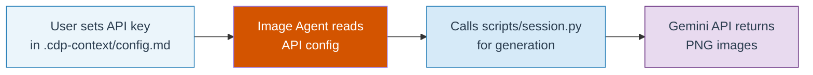

<objective>
Sweep all remaining browser automation references from SKILL.md, README.md, docs/README.md, and docs/ARCHITECTURE.md. Verify zero browser automation references remain in the entire repo.

Purpose: Complete DOC-04 (remove all browser automation references from image generation workflow). After Plan 01 updated infographics.md and ceo.md, these 4 files are the remaining sources of browser automation language.

Output: Four updated markdown files with API-based language, plus a verified-clean repo grep.
</objective>

<execution_context>
@/Users/luke/.claude/get-shit-done/workflows/execute-plan.md
@/Users/luke/.claude/get-shit-done/templates/summary.md
</execution_context>

<context>
@.planning/PROJECT.md
@.planning/ROADMAP.md
@.planning/STATE.md
@.planning/phases/04-scale-and-docs/04-CONTEXT.md
@.planning/phases/04-scale-and-docs/04-RESEARCH.md
@.planning/phases/04-scale-and-docs/04-01-SUMMARY.md
</context>

<tasks>

<task type="auto">
  <name>Task 1: Update SKILL.md browser automation references</name>
  <files>SKILL.md</files>
  <action>
Update 4 locations in SKILL.md where browser automation is referenced. Read the full file first to confirm line numbers, then apply these changes:

**Location 1: Lines 427-437 (Task A -- Image Agent description)**

Replace the current paragraph starting "Generates 5-6 analytical infographics via browser automation targeting the configured AI platform (Gemini or ChatGPT..." with:

```
Generates 5-6 analytical infographics via the Gemini API using
`scripts/session.py`. The Image Agent reads the Decision Record, extracts
data per infographic type, writes data JSON files, and calls the session
orchestrator. Each infographic is produced by populating a JSON prompt
template (Pauhu schema hybrid) with Decision Record data, applying style
overrides from `.cdp-context/style.md` (if present), and calling the
Gemini API with vision-based quality validation. Retries use corrective
feedback. If all attempts are exhausted, a placeholder PNG is generated
and the populated JSON prompt is saved alongside it for manual retry.
```

Remove: "browser automation targeting", "Gemini or ChatGPT", "submitting to the platform", "3-attempt escalation", "same conversation", "12-submission session cap", "conversation" references.

**Location 2: Line 532 (Orchestrator Spawn Sequence)**

Replace:
```
TaskCreate: "Generate analytical infographics via browser automation"  -> task A
```
With:
```
TaskCreate: "Generate analytical infographics via Gemini API script"  -> task A
```

**Location 3: Lines 613-625 (Platform Configuration section)**

Replace the entire "Platform Configuration" subsection (lines 613-625) with an "API Configuration" subsection:

```markdown
### API Configuration

A markdown file that configures the Gemini API for infographic generation.

- **Location:** `.cdp-context/config.md` in the project root
- **Create it:** Copy `templates/config-context.md` to `.cdp-context/config.md` and set your API key.
- **How it flows:** The generation script reads the API key, model ID, and retry limit before generating infographics. Pre-flight validation verifies the key and billing status.
- **Privacy:** The `.cdp-context/` directory is gitignored by default -- it contains sensitive business data and should not be committed.

Without this file, the generation script cannot run -- a valid API key is required.
```

Remove: "selects which AI platform", "Gemini or ChatGPT", "preferred platform", "defaults to Gemini", "switch to ChatGPT".

**Location 4: Line 637 (file reference for config.md)**

Replace:
```
- `.cdp-context/config.md` -- Platform configuration for Image Agent (user-created, gitignored)
```
With:
```
- `.cdp-context/config.md` -- API configuration for Image Agent (user-created, gitignored)
```
  </action>
  <verify>
    <automated>grep -n "browser.automation\|Browser Automation\|ChatGPT\|chatgpt\|platform selection\|fast-mode\|fast mode\|model picker\|gemini\.google\.com" SKILL.md | wc -l | grep -q "^0$" && echo "PASS: SKILL.md clean" || echo "FAIL: References remain in SKILL.md"</automated>
  </verify>
  <done>SKILL.md has zero browser automation references. Task A description, spawn sequence, and Platform Configuration section all updated to describe Gemini API script workflow.</done>
</task>

<task type="auto">
  <name>Task 2: Update README.md, docs/README.md, docs/ARCHITECTURE.md and verify full repo</name>
  <files>README.md, docs/README.md, docs/ARCHITECTURE.md</files>
  <action>
Update browser automation references in 3 files. Read each file first to confirm current line numbers match the RESEARCH.md inventory.

**File 1: README.md**

**Location 1a: Lines 564-598 (Platform Configuration section)**

Replace the entire "Platform Configuration" subsection with an "API Configuration" subsection:

```markdown
### API Configuration

A markdown file that configures the Gemini API for infographic generation.

**Location:** `.cdp-context/config.md` (gitignored by default)

**Create from template:**
```bash
mkdir -p .cdp-context
cp .claude/skills/corporate-decision-panel/templates/config-context.md .cdp-context/config.md
# Edit with your API key and preferred model
```

**Available settings:** Gemini API key (required), image model selection,
retry limit. See `templates/config-context.md` for all fields.


Without this file, the generation script cannot run -- a valid Gemini API key is required.
```

Remove: "Gemini or ChatGPT", "platform selection", "browser automation" from mermaid, "switch to ChatGPT".

**Location 1b: Line 722 (production pipeline table)**

Replace:
```
| A | `images/INFOGRAPHIC_*.png` | Browser automation (Gemini or ChatGPT / JSON prompts) | 5-6 analytical...
```
With:
```
| A | `images/INFOGRAPHIC_*.png` | Gemini API (Python script / JSON prompts) | 5-6 analytical...
```

**File 2: docs/README.md**

**Location 2a: Line 614 (production re-run description)**

Replace "browser automation issues" with "generation errors":
```
...Use this when images fail (generation errors) or outputs have errors...
```

**Location 2b: Lines 1394-1425 (Platform Configuration section)**

Replace the entire "10.3 Platform Configuration" subsection with "10.3 API Configuration":

```markdown
### 10.3 API Configuration

A markdown file that configures the Gemini API for infographic generation.

**Location:** `.cdp-context/config.md` (gitignored by default)

**Create from template:**

```bash
mkdir -p .cdp-context
cp .claude/skills/corporate-decision-panel/templates/config-context.md .cdp-context/config.md
# Edit with your API key and preferred model
```

**Available settings:** Gemini API key (required), image model selection,
retry limit. See `templates/config-context.md` for all fields.



Without this file, the generation script cannot run -- a valid Gemini API key is required.
```

Note: docs/README.md uses a different mermaid color palette (EBF5FB/2980B9/2C3E50) than README.md (e8f5e9/2e7d32/1a1a1a). Preserve each file's existing color palette in the updated mermaid diagrams.

**Location 2c: Line 1658 (production pipeline table)**

Replace:
```
| **A** | `images/INFOGRAPHIC_*.png` | Browser automation (Gemini or ChatGPT / JSON prompts) | 5-6 analytical...
```
With:
```
| **A** | `images/INFOGRAPHIC_*.png` | Gemini API (Python script / JSON prompts) | 5-6 analytical...
```

**File 3: docs/ARCHITECTURE.md**

**Location 3a: Lines 305-309 (Level 3.5: Platform Configuration)**

Replace the "Level 3.5: Platform Configuration" subsection with:

```markdown
### Level 3.5: API Configuration

A markdown file (`.cdp-context/config.md`) that configures the Gemini API for infographic generation. The Image Agent reads this at the start of the production pipeline to get the API key, model ID, and retry limit.

**Template:** [`templates/config-context.md`](../templates/config-context.md)
```

**Location 3b: Line 385 (production task table)**

Replace:
```
| A -- Image Agent | `images/INFOGRAPHIC_*.png` (5-6 infographics) | Browser automation (Gemini or ChatGPT / JSON prompts) |
```
With:
```
| A -- Image Agent | `images/INFOGRAPHIC_*.png` (5-6 infographics) | Gemini API (Python script / JSON prompts) |
```

**AFTER ALL EDITS -- Run verification grep:**

```bash
grep -rn --include="*.md" \
  -e "browser.automation" -e "Browser Automation" \
  -e "chatgpt\.com" -e "gemini\.google\.com" \
  -e "Platform Profile" -e "platform selection" \
  -e "model picker" -e "fast-mode" -e "fast mode" \
  -e "ChatGPT" \
  --exclude-dir=.planning --exclude-dir=.git .
```

This MUST return zero matches. If any remain, fix them before completing.

Note: "conversation" and "navigate" may appear legitimately in non-Image-Agent contexts (team lead agents, capsule structure). Only Image Agent / Task A / infographic contexts need removal. The grep pattern above does NOT include these ambiguous terms.
  </action>
  <verify>
    <automated>grep -rn --include="*.md" -e "browser.automation" -e "Browser Automation" -e "chatgpt\.com" -e "gemini\.google\.com" -e "Platform Profile" -e "platform selection" -e "model picker" -e "fast-mode" -e "fast mode" -e "ChatGPT" --exclude-dir=.planning --exclude-dir=.git . | wc -l | grep -q "^0$" && echo "PASS: Zero browser automation references in repo" || echo "FAIL: Browser automation references still exist"</automated>
  </verify>
  <done>All 4 files updated. Full repo grep for browser automation terms (browser automation, Browser Automation, chatgpt.com, gemini.google.com, Platform Profile, platform selection, model picker, fast-mode, fast mode, ChatGPT) returns zero matches outside .planning/ and .git/. DOC-04 is complete.</done>
</task>

</tasks>

<verification>
Full repo verification after both tasks complete:

1. **Zero browser automation references (DOC-04 gate):**
```bash
grep -rn --include="*.md" \
  -e "browser.automation" -e "Browser Automation" \
  -e "chatgpt\.com" -e "gemini\.google\.com" \
  -e "Platform Profile" -e "platform selection" \
  -e "model picker" -e "fast-mode" -e "fast mode" \
  -e "ChatGPT" \
  --exclude-dir=.planning --exclude-dir=.git .
```
Must return zero lines.

2. **API references present in all updated files:**
```bash
grep -l "Gemini API" SKILL.md README.md docs/README.md docs/ARCHITECTURE.md templates/production/infographics.md agents/ceo.md
```
Must return all 6 files.

3. **Existing tests still pass:**
```bash
cd /Volumes/Data/dev/corporate-decision-panel && python -m pytest tests/ -x -m "not live"
```
Must pass (no Python code was changed).
</verification>

<success_criteria>
- SKILL.md Task A description, spawn sequence, and configuration section all describe Gemini API, not browser automation
- README.md Platform Configuration replaced with API Configuration, production table updated
- docs/README.md Platform Configuration replaced, production re-run description updated, production table updated
- docs/ARCHITECTURE.md Level 3.5 and production table updated
- Full repo grep for browser automation terms returns zero matches (excluding .planning/ and .git/)
- All existing pytest tests pass unchanged
</success_criteria>

<output>
After completion, create `.planning/phases/04-scale-and-docs/04-02-SUMMARY.md`
</output>
