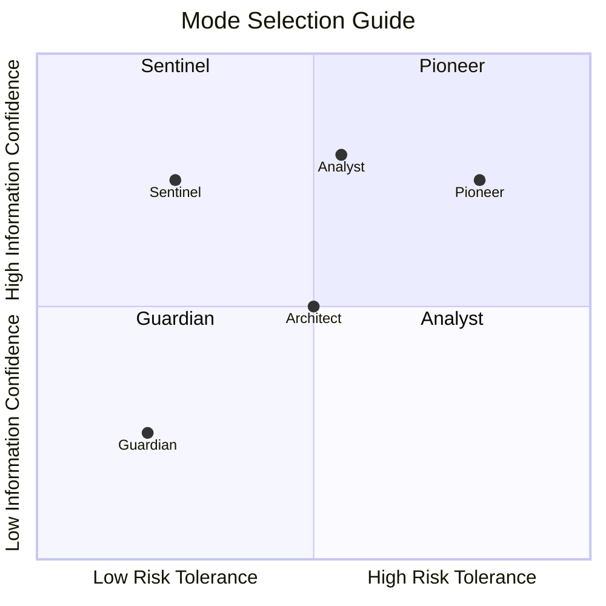
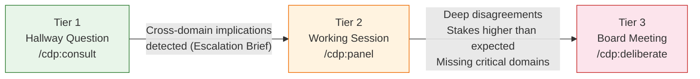
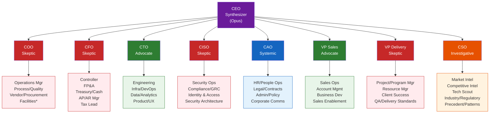
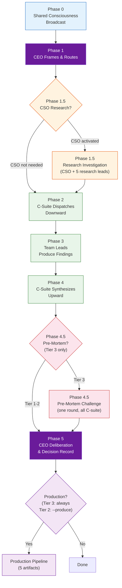
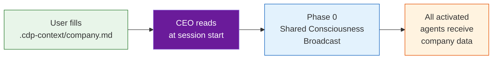
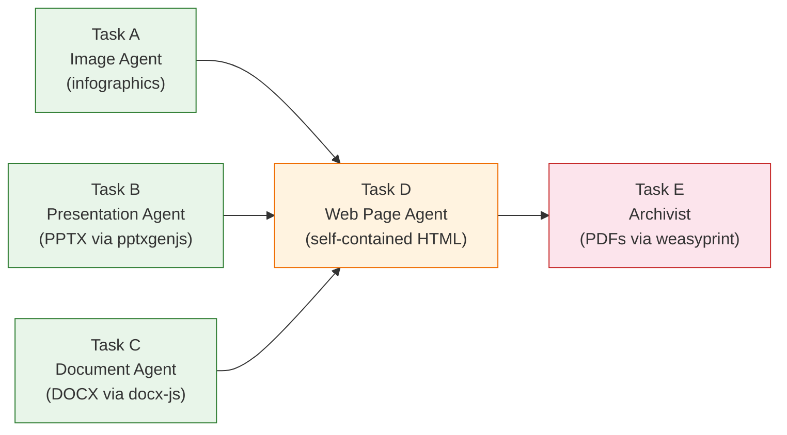

# Corporate Decision Panel

**A boardroom in a box.** Present any business issue and receive structured, multi-perspective analysis with engineered dissent -- not consensus from a single voice, but a decision that shows where expert perspectives collide and why.

CDP emulates an SMB executive committee: a CEO frames and routes, C-suite executives analyze through domain lenses, specialist team leads produce findings, and the CEO synthesizes a decision that addresses the strongest objections. Operates at three engagement tiers (hallway question, working session, board meeting) and five synthesis modes (Guardian, Pioneer, Architect, Analyst, Sentinel).

Runs as a [Claude Code](https://docs.anthropic.com/en/docs/claude-code) agent skill.

---

## Install

Clone into your project's `.claude/skills/` directory and run the installer:

```bash
mkdir -p .claude/skills
git clone https://github.com/apatheticus/corporate-decision-panel .claude/skills/corporate-decision-panel
python3 .claude/skills/corporate-decision-panel/install.py
```

The installer copies agent definitions and slash commands into your project's `.claude/` directory so they're available immediately when you start Claude Code. If you skip the installer, CDP will auto-setup on first use -- but slash commands won't be available until you restart the session.

### Update

```bash
cd .claude/skills/corporate-decision-panel && git pull && python3 install.py
```

### Global install (all projects)

```bash
mkdir -p ~/.claude/skills
git clone https://github.com/apatheticus/corporate-decision-panel ~/.claude/skills/corporate-decision-panel
python3 ~/.claude/skills/corporate-decision-panel/install.py
```

---

## Table of Contents

- [Corporate Decision Panel](#corporate-decision-panel)
  - [Install](#install)
    - [Update](#update)
    - [Global install (all projects)](#global-install-all-projects)
  - [Table of Contents](#table-of-contents)
  - [Quick Start](#quick-start)
  - [Commands](#commands)
    - [`/cdp:consult` -- Tier 1 Hallway Question](#cdpconsult----tier-1-hallway-question)
    - [`/cdp:panel` -- Tier 2 Working Session](#cdppanel----tier-2-working-session)
    - [`/cdp:deliberate` -- Tier 3 Board Meeting](#cdpdeliberate----tier-3-board-meeting)
    - [`/cdp:evaluate` -- Auto-Triage](#cdpevaluate----auto-triage)
    - [Multi-Mode Syntax](#multi-mode-syntax)
    - [Available Roles](#available-roles)
  - [Decision Modes](#decision-modes)
  - [Engagement Tiers](#engagement-tiers)
  - [Architecture](#architecture)
    - [Agent Hierarchy](#agent-hierarchy)
    - [Model Tiering](#model-tiering)
    - [Engineered Dissent](#engineered-dissent)
    - [C-Suite Roster](#c-suite-roster)
    - [Team Lead Roster](#team-lead-roster)
    - [Five-Phase Cascade](#five-phase-cascade)
  - [Configuration](#configuration)
    - [Company Profile](#company-profile)
    - [Company Context](#company-context)
    - [Routing Table](#routing-table)
  - [Output Formats](#output-formats)
  - [Production Pipeline](#production-pipeline)
    - [Trigger Logic](#trigger-logic)
    - [Session Output Directory](#session-output-directory)
    - [Artifact Pipeline](#artifact-pipeline)
  - [Optional Dependencies](#optional-dependencies)
  - [Repository Structure](#repository-structure)
  - [Design Principles](#design-principles)
  - [Reference Materials](#reference-materials)

---

## Quick Start

**Quick consult with one executive** (Tier 1 -- seconds):
```
/cdp:consult cfo: Can we afford to hire 15 engineers this quarter?
```

**Working session with a focused panel** (Tier 2 -- minutes):
```
/cdp:panel finance tech: Should we build this feature in-house or buy?
```

**Full board deliberation** (Tier 3 -- comprehensive analysis):
```
/cdp:deliberate: Should we pivot to a platform model?
```

Not sure which tier? Let the CEO assess:
```
/cdp:evaluate: Should we acquire CompetitorX?
```

---

## Commands

### `/cdp:consult` -- Tier 1 Hallway Question

Quick, opinionated consult with one C-suite agent. No CEO, no routing, no team leads. Produces an Advisory Note (3-5 sentences).

```
/cdp:consult [role] [mode?]: [question]
```

| Parameter | Required | Description |
|-----------|----------|-------------|
| `role` | Yes | C-suite agent to consult |
| `mode` | No | Decision mode (defaults to Analyst) |

**Examples:**
```
/cdp:consult cfo: Can we afford to hire 15 engineers this quarter?
/cdp:consult ciso guardian: What are the risks of this vendor integration?
/cdp:consult vp-sales pioneer: How does this feature help us sell more?
```

### `/cdp:panel` -- Tier 2 Working Session

CEO frames and routes to 2-4 C-suite members. Full domain analysis with team lead delegation. CEO produces lightweight synthesis. Produces a Panel Assessment (~1 page).

```
/cdp:panel [--produce] [mode?] [roles]: [issue]
```

| Parameter | Required | Description |
|-----------|----------|-------------|
| `roles` | Yes | 2-4 C-suite roles or domain shorthands (e.g., `finance tech`) |
| `mode` | No | Decision mode (defaults to Analyst) |
| `--produce` | No | Triggers the production pipeline (HTML, PPTX, DOCX, PDFs) |

**Examples:**
```
/cdp:panel finance tech: Should we build this feature in-house?
/cdp:panel pioneer finance tech sales: Should we acquire CompetitorX?
/cdp:panel --produce operations delivery: Should we restructure the PMO?
```

### `/cdp:deliberate` -- Tier 3 Board Meeting

Full five-phase cascade. All relevant C-suite activated via routing table. Full team lead analysis. Pre-mortem challenge. Complete CEO deliberation. Produces a Decision Record (3-5 pages). Production always triggered.

```
/cdp:deliberate [mode?]: [issue]
```

| Parameter | Required | Description |
|-----------|----------|-------------|
| `mode` | No | Decision mode, multi-mode comparison, or `all-modes` |

**Examples:**
```
/cdp:deliberate: Should we pivot to a platform model?
/cdp:deliberate guardian: Should we take on $10M in debt for expansion?
/cdp:deliberate guardian vs pioneer: Should we enter the enterprise market?
/cdp:deliberate all-modes: Should we acquire CompetitorX?
```

### `/cdp:evaluate` -- Auto-Triage

CEO assesses the issue and recommends a tier, mode, and routing. You accept, override, or select a different configuration.

```
/cdp:evaluate: [issue]
```

**CEO evaluates:** scope (single-domain / multi-domain / cross-cutting), impact (low / medium / high / critical), and reversibility (easily reversed / difficult / irreversible), then recommends tier and mode with rationale.

### Multi-Mode Syntax

Domain analysis runs once. CEO synthesis runs per mode. Cost: ~1.1x a single deliberation for up to 5x the strategic insight.

```
/cdp:deliberate guardian vs pioneer: [issue]                 # Two-mode comparison
/cdp:deliberate guardian vs analyst vs sentinel: [issue]     # Three modes
/cdp:deliberate all-modes: [issue]                           # All five modes
/cdp:consult cfo guardian: [question]                        # Tier 1 with mode
/cdp:panel pioneer finance tech: [issue]                     # Tier 2 with mode
```

Multi-mode produces a **Comparative Decision Record** with shared analysis, per-mode synthesis, divergence analysis, and a **Mode Sensitivity** rating indicating whether evidence speaks for itself (all modes converge) or the user's risk appetite is the deciding factor (modes diverge).

### Available Roles

`ceo` `coo` `cfo` `cto` `ciso` `cao` `vp-sales` `vp-delivery` `cso`

---

## Decision Modes

Five CEO synthesis prompt modifiers derived from established decision theory (Rowe & Boulgarides Decision Style Theory + classical operations research). Domain analysis is identical across modes -- different weighting produces different decisions from the same evidence.

| Mode | Disposition | Decision Theory | Resolution Pattern |
|------|-------------|-----------------|-------------------|
| **Guardian** | Cautious -- would rather miss an opportunity than take a damaging risk | MaxiMin (maximize minimum outcome) | Weights skeptics (CISO, CFO, COO, VP Delivery). Skeptics must be satisfied, not just acknowledged. Tends toward: don't do it, smaller version, or extensive guardrails. |
| **Pioneer** | Growth-oriented -- biggest risk is standing still | MaxiMax (maximize maximum outcome) | Weights advocates (VP Sales, CTO). Skeptic concerns treated as engineering problems, not reasons to stop. Tends toward: do it, do it bigger, do it faster. |
| **Architect** | Consensus-builder -- decisions succeed on organizational alignment | Behavioral (optimize for buy-in) | Weights the fault lines themselves. Seeks the position satisfying the most domain concerns. Conditions drawn from multiple domains. |
| **Analyst** | Data-driven -- distrusts optimism and pessimism, trusts evidence | Hurwicz (balanced weighting by confidence) | Weights confidence levels regardless of role. High-confidence findings outweigh low-confidence regardless of source. "Defer pending better data" is legitimate. **Default mode.** |
| **Sentinel** | Regret minimizer -- "if this is wrong, can we recover?" | MiniMax Regret (minimize maximum regret) | Disproportionately weights the strongest objection from ANY role. Favors paths where being wrong is survivable over paths where being right is spectacular. |



When unsure, start with Analyst (default). Use multi-mode comparison (`guardian vs pioneer`) when the decision hinges on risk appetite. Use `all-modes` for irreversible decisions to see the full spectrum.

---

## Engagement Tiers

| | Tier 1: Hallway Question | Tier 2: Working Session | Tier 3: Board Meeting |
|---|---|---|---|
| **Command** | `/cdp:consult` | `/cdp:panel` | `/cdp:deliberate` |
| **Who's involved** | 1 C-suite agent | CEO + 2-4 C-suite + their team leads | CEO + all relevant C-suite + all team leads |
| **Output** | Advisory Note (3-5 sentences) | Panel Assessment (~1 page) | Decision Record (3-5 pages) |
| **Production artifacts** | Advisory Document (DOCX) | Optional (`--produce`) | Always |
| **Phases executed** | Direct consult only | Phase 1 → 2 → 3 → 4 → 5 | Phase 0 → 1 → 1.5? → 2 → 3 → 4 → 4.5 → 5 |
| **Pre-mortem** | No | No | Yes (Phase 4.5) |
| **CSO research** | No | If CSO activated | If CEO directs (Phase 1.5) |
| **When to use** | Quick gut-check, single-domain question | Focused multi-perspective analysis | High-stakes, irreversible, or cross-cutting decisions |



The skill defaults to lightweight engagement. Most SMB decisions are fast, informal, and made by one or two people. Tier 1 is the daily habit; Tier 3 is the deliberate escalation.

---

## Architecture

### Agent Hierarchy



<sub>*Facilities/Office Manager conditionally active based on company archetype.</sub>

### Model Tiering

| Layer | Model | Rationale |
|-------|-------|-----------|
| CEO | Opus | Cross-domain synthesis. Highest reasoning quality for weighting competing perspectives. |
| C-Suite (8 agents) | Sonnet | Domain decomposition and synthesis. Balances capability with cost. |
| Team Leads (34 agents) | Haiku | Narrow specialist analysis. Cost-efficient. Model diversity improves system robustness. |

### Engineered Dissent

The roster is deliberately skeptic-heavy to counterbalance the optimism bias that both humans and LLMs exhibit:

- **4 Skeptics** (COO, CFO, CISO, VP Delivery) -- surface risks, costs, and constraints
- **2 Advocates** (CTO, VP Sales) -- champion opportunity and growth
- **1 Systemic** (CAO) -- assess organizational absorption capacity
- **1 Investigative** (CSO) -- produce evidence, not opinions
- **1 Synthesizer** (CEO) -- weigh, judge, decide

Advocates carry a mandatory mitigation: they must name the strongest objection to their own position and explain why they still advocate despite it.

### C-Suite Roster

| Role | Disposition | Mandate |
|------|-------------|---------|
| CEO | Synthesizer | Frame, listen, weigh, decide. Value is judgment. |
| COO | Skeptic | "Can we actually do this with the people and processes we have?" |
| CFO | Skeptic | "Find the costs that aren't in the proposal." |
| CTO | Advocate | "What does this make possible that wasn't possible before?" |
| CISO | Skeptic | "Change introduces risk. You are the organization's immune system." |
| CAO | Systemic | "Can the organization -- people, policies, culture -- absorb this?" |
| VP Sales | Advocate | "How does this help us sell more, faster, or to new markets?" |
| VP Delivery | Skeptic | "What do we sacrifice from existing commitments to do this?" |
| CSO | Investigative | "What does the evidence say? Bring facts where others bring assumptions." |

### Team Lead Roster

Each team lead has a unique analytical framework, mandatory output template, three forcing questions, and restricted tool access (Read, Grep, Glob, WebSearch only). 14 of 34 have a fourth Cross-Domain Challenge question targeting high-interaction pairs.

| C-Suite Parent | Team Leads | Count |
|----------------|------------|-------|
| COO | Operations Mgr, Process/Quality Lead, Vendor/Procurement Mgr, Facilities/Office Mgr* | 4 |
| CFO | Controller, Head of FP&A, Treasury/Cash Mgr, AP/AR Mgr, Tax Lead | 5 |
| CTO | Engineering Lead, Infrastructure/DevOps Lead, Data/Analytics Lead, Product/UX Lead | 4 |
| CISO | Security Ops Lead, Compliance/GRC Lead, Identity & Access Lead, Security Architecture Lead | 4 |
| VP Sales | Sales Ops Lead, Account Mgmt Lead, Business Dev Lead, Sales Enablement Lead | 4 |
| VP Delivery | Project/Program Mgr, Resource Mgr, Client Success Lead, QA/Delivery Standards Lead | 4 |
| CAO | HR/People Ops Lead, Legal/Contracts Lead, Admin/Policy Lead, Corporate Comms Lead | 4 |
| CSO | Market Intel Lead, Competitive Intel Lead, Technology Scout Lead, Industry/Regulatory Analyst, Precedent/Patterns Analyst | 5 |
| **Total** | | **34** |

### Five-Phase Cascade



**Phase 0 -- Shared Consciousness Broadcast:** CEO broadcasts issue context, company data, routing rationale, and active decision mode to all activated C-suite agents simultaneously.

**Phase 1 -- CEO Frames & Routes:** CEO decomposes the issue into evaluation dimensions, classifies decision type, selects routing via the routing table, evaluates full-activation thresholds, and states both activation and exclusion reasoning.

**Phase 1.5 -- Research Investigation (conditional):** If CSO is activated, the CSO dispatches 5 research team leads, synthesizes findings into a Research Dossier with evidence quality grade and Assumption Registry, and broadcasts to all C-suite.

**Phase 2 -- C-Suite Dispatches Downward:** Each C-suite agent translates CEO framing into domain-specific sub-questions for their team leads. This is analytical translation, not forwarding.

**Phase 3 -- Team Leads Produce Findings:** Each team lead performs narrow, focused analysis through their specialist lens using their unique analytical framework and mandatory output template.

**Phase 4 -- C-Suite Synthesizes Upward:** Each C-suite agent collects team lead findings and produces a domain recommendation with confidence level, key risks, key opportunities, and flagged internal contradictions.

**Phase 4.5 -- Pre-Mortem Challenge (Tier 3 only):** Each C-suite agent receives summaries of all peer recommendations and answers: "Assume this decision fails catastrophically in 12 months. What caused the failure?" One round only.

**Phase 5 -- CEO Deliberation:** CEO maps domain recommendations onto a decision matrix, identifies fault lines, determines the most determinative perspective, applies the active decision mode, and produces the Decision Record.

---

## Configuration

### Company Profile

Archetype presets define roster modifications, default mode, compliance focus, and escalation behavior for different industry types.

| Archetype | Default Mode | Compliance Focus | Escalation Bias | Key Roster Changes |
|-----------|-------------|------------------|-----------------|-------------------|
| **Technology / SaaS** (default) | Analyst | SOC 2, GDPR | Normal | Facilities inactive, Product/UX active |
| **Professional Services** | Architect | Client contracts, professional liability | Normal | All active, VP Delivery weighted heavily |
| **Regulated Industry** | Guardian | HIPAA, SOX, PCI-DSS (auto-configured) | Conservative | Compliance/GRC expanded, CISO + CAO Legal always active |
| **Manufacturing / Physical** | Analyst | Safety standards, environmental | Normal | Facilities active, Vendor/Procurement weighted |

**Override mechanism:** Select an archetype during setup, then override individual settings:

```yaml
archetype: technology-saas        # Base preset

overrides:
  roster:
    facilities-office-manager: active
  default_mode: guardian
  escalation_bias: conservative
  compliance_frameworks:
    - SOC 2
    - HIPAA
```

**Calibration protocol:** After initial configuration, run a contentious test issue through all five decision modes. Verify that at least 3 of 5 modes produce materially different outcomes. If they don't, prompt modifiers need revision.

See [`config/company-profile.md`](config/company-profile.md) for full specification.

### Company Context

An optional markdown file containing real company data -- financials, headcount, tech stack, strategic position, constraints -- that grounds agent reasoning in facts rather than generic frameworks.

**Location:** `.cdp-context/company.md` (gitignored by default)

**Create from template:**
```bash
mkdir -p .cdp-context
cp .claude/skills/corporate-decision-panel/templates/company-context.md .cdp-context/company.md
# Edit with your company's actual data
```

**Available sections:** Company Overview, Financial Position, Team & Organization, Technology, Operations, Strategic Position, Constraints & Context. All sections are optional -- agents use whatever is provided and note confidence gaps for what's missing.



Without this file, agents reason using general frameworks. With it, agents ground their analysis in actual numbers and constraints.

**Privacy:** The `.cdp-context/` directory is gitignored by default. It contains sensitive business data and should never be committed.

### Routing Table

Default C-suite activation by decision type:

| Decision Type | Default Activation | Description |
|--------------|-------------------|-------------|
| Strategic | CEO, CFO, CTO, VP Sales | Acquisition, market strategy, competitive positioning |
| Operational | CEO, COO, VP Delivery | Process change, workflow restructuring, org restructure |
| Financial | CEO, CFO, COO | Funding, major investment, cost reduction |
| Technical | CEO, CTO, CISO | Platform migration, architecture, technology adoption |
| Personnel | CEO, CAO, COO, VP Delivery | Layoff, major hiring, reorganization |
| Compliance/Risk | CEO, CISO, CAO, CFO | Regulatory change, breach response, audit |

The CEO can always override defaults by adding or removing C-suite members.

**Full-activation threshold conditions** -- if ANY apply, all C-suite members activate:

1. **Irreversibility** -- acquisition, divestiture, platform decommission
2. **Headcount impact >30%** -- layoff, rapid scaling, reorg
3. **Market position change** -- pivot, new market entry, pricing model change
4. **Existential financial risk** -- bet-the-company investment, funding dependency
5. **Domain uncertainty** -- novel or unprecedented situation

**CSO research activation patterns:**

| Decision Type | CSO Activation | Rationale |
|--------------|---------------|-----------|
| Strategic | Usually | Market data, competitor analysis, precedent research |
| Compliance/Risk | Usually | Regulatory landscape, legal precedent |
| Financial | Sometimes | Market conditions, precedent transactions |
| Technical | Sometimes | Technology landscape, vendor comparisons |
| Operational | Rarely | Internal processes rarely need external evidence |
| Personnel | Rarely | Internal HR decisions rarely need external research |

See [`config/routing-table.md`](config/routing-table.md) for full specification.

---

## Output Formats

| Tier | Output Format | Length | Production |
|------|--------------|--------|------------|
| Tier 1 | Advisory Note | 3-5 sentences | Advisory Document (DOCX) |
| Tier 2 | Panel Assessment | ~1 page | Optional (`--produce`) |
| Tier 3 | Decision Record | 3-5 pages | Always |
| Multi-mode | Comparative Decision Record | Extended | Always |

**Advisory Note** (Tier 1) -- Direct, opinionated, domain-specific response from a single C-suite agent. Includes confidence level. May include an Escalation Brief if cross-domain implications are detected.

**Panel Assessment** (Tier 2) -- Issue summary, activated domains, per-domain recommendations with confidence, key agreements/disagreements, CEO synthesis, and next steps. Lightweight enough for daily use.

**Decision Record** (Tier 3) -- Nine sections: Executive Summary, Issue Statement, CEO Framing, Domain Analyses (per-domain with team lead findings), Fault Line Analysis, CEO Decision, Dissenting Views, Next Steps, and Metadata.

**Comparative Decision Record** (multi-mode) -- Shared domain analysis plus per-mode CEO synthesis, divergence analysis showing where modes agree and diverge, and a Mode Sensitivity rating.

See the [`templates/`](templates/) directory for full output format specifications.

---

## Production Pipeline

### Trigger Logic

| Tier | Production | Notes |
|------|-----------|-------|
| Tier 1 | Advisory Document (DOCX) | Produces a formal Advisory Document from the Advisory Note |
| Tier 2 | `--produce` flag | `/cdp:panel --produce ...` |
| Tier 3 | Always | Automatic after Decision Record |

### Session Output Directory

All production artifacts are written to a per-session directory:

```
.cdp-output/YYYY-MM-DD_<issue-slug>/
├── index.html                                    # Interactive decision briefing
├── PRESENTATION_<issue-slug>.pptx                # Board-ready slide deck
├── REPORT_<issue-slug>.docx                      # Editable document
├── RESULTS_<issue-slug>.pdf                      # Print rendering of briefing
├── CAPSULE_<issue-slug>.pdf                      # Layered archival record
├── images/                                       # Analytical infographics
│   ├── INFOGRAPHIC_routing-diagram.png
│   ├── INFOGRAPHIC_domain-scorecard.png
│   ├── INFOGRAPHIC_fault-lines.png
│   ├── INFOGRAPHIC_risk-matrix.png
│   ├── INFOGRAPHIC_action-plan.png
│   └── INFOGRAPHIC_mode-comparison.png           # Multi-mode only
└── build/                                        # Rerunnable build scripts
    ├── build_presentation.js
    ├── build_report.js
    └── build_capsule.py
```

### Artifact Pipeline

Five production agents with a dependency chain -- the first three run in parallel, then the web page assembles them, then the archivist produces final PDFs:



| Task | Artifact | Technology | Description |
|------|----------|-----------|-------------|
| A | `images/INFOGRAPHIC_*.png` | Browser automation | 5-6 analytical infographics: routing diagram, domain scorecard, fault line map, risk-opportunity matrix, action plan timeline, mode comparison (multi-mode) |
| B | `PRESENTATION_*.pptx` | pptxgenjs (Node.js) | 11-slide board-ready deck: title, exec summary, the question, framework, domain analyses, fault lines, decision, guardrails, risks, next steps, metadata |
| C | `REPORT_*.docx` | docx (Node.js) | Editable document: cover, TOC, 8 sections, 2 appendices. US Letter, Arial 12pt. |
| D | `index.html` | Vanilla HTML/CSS/JS | Self-contained interactive briefing page. No CDN, works from `file://`. Embeds infographics, links PPTX/DOCX downloads. |
| E | `RESULTS_*.pdf` + `CAPSULE_*.pdf` | weasyprint (Python) | Results PDF: print rendering of HTML. Capsule PDF: 5-layer archival record (Overview, Decision, Analysis, Process, Context). |

**Technology requirements:** `pptxgenjs` and `docx` (npm packages), `weasyprint` (Python, for PDF generation).

---

## Optional Dependencies

The production pipeline (all tiers) uses these external skills for generating artifacts. Tier 1 requires only the `docx` npm package for the Advisory Document.

| Skill | Used For | Install |
|-------|----------|---------|
| [docx](https://github.com/anthropics/skills) | Board document (DOCX) generation | `/find-skills docx` |
| [pdf](https://github.com/anthropics/skills) | Results PDF and Capsule PDF | `/find-skills pdf` |
| [frontend-design](https://github.com/anthropics/skills) | Decision briefing page (HTML) | `/find-skills frontend-design` |
| [web-design-guidelines](https://github.com/vercel-labs/agent-skills) | UI review for briefing page | `/find-skills web-design-guidelines` |
| [find-skills](https://github.com/vercel-labs/skills) | Skill discovery | `/install find-skills` |
| [skill-creator](https://github.com/anthropics/skills) | Skill authoring (development only) | `/find-skills skill-creator` |

---

## Repository Structure

```
corporate-decision-panel/               # Clone to .claude/skills/corporate-decision-panel
├── SKILL.md                            # Skill definition + auto-setup
├── README.md
├── install.py                          # Pre-session command/agent installer
├── LICENSE
├── CONTRIBUTING.md
├── COLLABORATORS.md
├── .gitignore
├── agents/                             # Agent definitions (copied to .claude/agents/ on setup)
│   ├── ceo.md
│   ├── c-suite/
│   │   └── ... (8 agents)
│   └── team-leads/
│       └── ... (34 agents across 8 domains)
├── commands/                           # Slash commands (copied to .claude/commands/ on setup)
│   └── cdp/
│       ├── consult.md, panel.md
│       ├── deliberate.md, evaluate.md
├── config/
│   ├── company-profile.md
│   ├── decision-modes.md
│   └── routing-table.md
└── templates/
    ├── advisory-note.md
    ├── company-context.md
    ├── comparative-decision-record.md
    ├── decision-record.md
    ├── panel-assessment.md
    └── production/
        ├── advisory-document.md        # Tier 1 DOCX spec
        ├── board-document.md
        ├── board-presentation.md
        ├── capsule-structure.md
        └── decision-briefing-page.md
```

---

## Design Principles

- **SMB-first bias.** Defaults to lightweight engagement. Most SMB decisions are fast, informal, and made by one or two people. Tier 1 is the daily habit; Tier 3 is the deliberate escalation. Default cell: Tier 1 + Analyst.
- **Engineered dissent.** 4 skeptics, 2 advocates, 1 systemic, 1 investigative. Skeptic-heavy to counterbalance human optimism bias. Disagreement is signal, not noise.
- **Transparent routing.** Every activation and exclusion decision comes with explicit reasoning. The CEO states who is in, who is out, and why.
- **Fault lines as primary signal.** Where perspectives collide is the most valuable output. The Decision Record preserves disagreement at full strength rather than averaging it away.
- **Mode-independent domain analysis.** Domain analysis runs once regardless of synthesis mode. Modes change how the CEO weighs evidence, not what evidence is gathered.
- **Two-tier visibility.** Team lead findings flow through their C-suite parent, not directly to the CEO. This preserves domain-level synthesis and prevents the CEO from cherry-picking raw findings.
- **"Defer" is legitimate.** Investigation is not indecision. When evidence is insufficient, recommending further research is a rational outcome.

---

## Reference Materials

For detailed specifications, see the config and template files:
- [SKILL.md](SKILL.md) -- Complete skill specification
- [config/decision-modes.md](config/decision-modes.md) -- Five mode definitions with full CEO prompt modifiers
- [config/routing-table.md](config/routing-table.md) -- Routing defaults and threshold conditions
- [config/company-profile.md](config/company-profile.md) -- Archetype presets and override mechanism
- [templates/](templates/) -- All output format and production artifact specifications

---

<div align="center">

<br></br>

**[Back to Top](#corporate-decision-panel)**

Made with 💨 by the Zerø Effort

Copyright 2026

</div>
