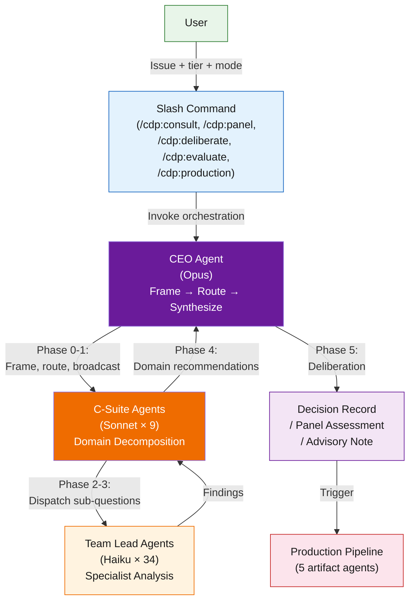
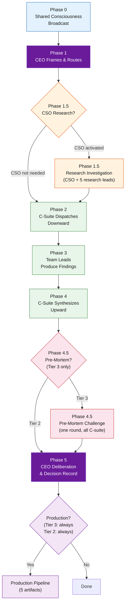
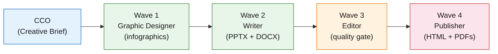

<div align="center">

# Architecture

### Corporate Decision Panel -- Technical Reference

*How CDP works under the hood.*

*Version 1.0 · February 2026*

</div>

---

## Table of Contents

- [Overview](#overview)
- [System Diagram](#system-diagram)
- [Three-Layer Agent Hierarchy](#three-layer-agent-hierarchy)
- [Engineered Dissent](#engineered-dissent)
- [Five-Phase Cascade](#five-phase-cascade)
- [Data Flow](#data-flow)
- [Configuration Architecture](#configuration-architecture)
- [Decision Modes](#decision-modes)
- [Engagement Tiers](#engagement-tiers)
- [Production Pipeline](#production-pipeline)
- [Agent Anatomy](#agent-anatomy)
- [Extension Points](#extension-points)
- [Design Principles](#design-principles)

---

## Overview

The Corporate Decision Panel (CDP) is an agent-based organizational reasoning engine built on the [Claude Code](https://docs.anthropic.com/en/docs/claude-code) skill framework. It emulates an SMB executive committee by routing a business question through a structured hierarchy of 43 agents with engineered dissent -- producing a decision record that preserves where expert perspectives collide rather than averaging them away.

At the technical level, CDP is a prompt-and-configuration system. There is no traditional application code. The entire system is defined through:

- **Agent definitions** -- Markdown files that specify identity, mandate, analytical framework, output template, and forcing questions for each agent
- **Slash commands** -- Markdown entry points that parse user input and invoke the orchestration protocol
- **Configuration files** -- Routing rules, decision mode definitions, and company archetype presets
- **Output templates** -- Structured formats for advisory notes, panel assessments, decision records, and production artifacts

The skill entry point ([`SKILL.md`](../SKILL.md)) defines the orchestration protocol that coordinates these components into a multi-phase cascade.

---

## System Diagram



---

## Three-Layer Agent Hierarchy

CDP uses a strict three-layer hierarchy where each layer serves a distinct analytical purpose and runs on a different model tier.

### Layer 1: CEO (Opus)

The CEO is the sole orchestrator and synthesizer. It frames the issue, routes to the appropriate C-suite members, broadcasts shared context, and produces the final decision. The CEO does not possess deeper domain knowledge than any C-suite officer -- its value is cross-domain judgment.

**Definition:** [`agents/ceo.md`](../agents/ceo.md)

### Layer 2: C-Suite (Sonnet × 9)

Nine domain executives, each spawned as a teammate in the CEO's executive team. Analytical C-suite agents translate the CEO's framing into domain-specific sub-questions, create division teams, spawn team leads as teammates, and synthesize domain recommendations upward. Each has a fixed perspective type (skeptic, advocate, systemic, investigative, or production) that governs how they interpret evidence.

| Role | Disposition | Definition |
|------|-------------|------------|
| COO | Skeptic | [`agents/c-suite/coo.md`](../agents/c-suite/coo.md) |
| CFO | Skeptic | [`agents/c-suite/cfo.md`](../agents/c-suite/cfo.md) |
| CTO | Advocate | [`agents/c-suite/cto.md`](../agents/c-suite/cto.md) |
| CISO | Skeptic | [`agents/c-suite/ciso.md`](../agents/c-suite/ciso.md) |
| CAO | Systemic | [`agents/c-suite/cao.md`](../agents/c-suite/cao.md) |
| VP Sales | Advocate | [`agents/c-suite/vp-sales.md`](../agents/c-suite/vp-sales.md) |
| VP Delivery | Skeptic | [`agents/c-suite/vp-delivery.md`](../agents/c-suite/vp-delivery.md) |
| CSO | Investigative | [`agents/c-suite/cso.md`](../agents/c-suite/cso.md) |
| CCO | Production | [`agents/c-suite/cco.md`](../agents/c-suite/cco.md) |

### Layer 3: Team Leads (Haiku × 34)

Narrow specialists spawned as teammates in their C-suite parent's division team. Each has a unique analytical framework, mandatory output template, and forcing questions. Team leads SendMessage findings to their C-suite parent only -- the CEO never sees raw team lead output.

**Definitions:** [`agents/team-leads/{domain}/*.md`](../agents/team-leads/)

### Model Tiering Rationale

| Layer | Model | Count | Purpose | Why This Model |
|-------|-------|-------|---------|----------------|
| CEO | Opus | 1 | Cross-domain synthesis, weighting competing perspectives | Highest reasoning quality for the hardest analytical task |
| C-Suite | Sonnet | 9 | Domain decomposition, team lead coordination, domain synthesis | Balances analytical capability with cost |
| Team Leads | Haiku | 34 | Narrow specialist analysis within a single domain | Cost-efficient for focused tasks; model diversity improves system robustness |

The three-model design is intentional. Using Opus for all 43 agents would be prohibitively expensive. Using Haiku for synthesis would sacrifice quality where it matters most. The tiering matches model capability to task complexity.

---

## Engineered Dissent

The C-suite roster is deliberately skeptic-heavy to counterbalance the optimism bias that both humans and LLMs exhibit:

| Perspective Type | Count | Agents | Role |
|-----------------|-------|--------|------|
| **Skeptic** | 4 | COO, CFO, CISO, VP Delivery | Surface risks, costs, and constraints |
| **Advocate** | 2 | CTO, VP Sales | Champion opportunity and growth |
| **Systemic** | 1 | CAO | Assess organizational absorption capacity |
| **Investigative** | 1 | CSO | Produce evidence, not opinions |
| **Synthesizer** | 1 | CEO | Weigh, judge, decide |

This 4-2-1-1-1 composition is the system's core design decision. In a typical boardroom, optimism dominates because proposals are brought by their advocates. CDP inverts this: every proposal faces structured opposition by default.

### Advocate Mitigation

Advocates (CTO, VP Sales) carry a mandatory mitigation requirement: they must name the strongest objection to their own position and explain why they still advocate despite it. This prevents advocates from producing one-sided analysis while preserving their growth-oriented lens.

### Why Not Equal Balance?

Equal skeptic-advocate balance (4-4) would reproduce the false balance problem that CDP exists to solve. LLMs already tend toward agreeableness. A system that gives equal voice to optimism and caution will drift toward optimism because the model's base tendency amplifies the advocates' position. The skeptic-heavy roster is a structural correction.

---

## Five-Phase Cascade

The full cascade executes for Tier 2 and Tier 3 engagements. Tier 1 bypasses it entirely (direct C-suite consult).



### Phase 0 -- Shared Consciousness Broadcast

The CEO broadcasts issue context, company data, routing rationale, and the active decision mode to all activated C-suite agents simultaneously. Implements McChrystal's shared consciousness principle: every agent sees the same picture before reasoning independently.

### Phase 1 -- CEO Frames & Routes

The CEO decomposes the issue into evaluation dimensions, classifies the decision type (Strategic, Operational, Financial, Technical, Personnel, Compliance/Risk), selects routing via the [routing table](../config/routing-table.md), evaluates full-activation threshold conditions, and states both activation and exclusion reasoning.

### Phase 1.5 -- Research Investigation (conditional)

If the CEO activates the CSO, the CSO dispatches 5 research team leads (Market Intelligence, Competitive Intelligence, Technology Scout, Industry & Regulatory Analyst, Precedent & Patterns Analyst). The CSO synthesizes findings into a Research Dossier with an evidence quality grade and Assumption Registry, then broadcasts it to all activated C-suite. Skipped when the CSO is not activated.

### Phase 2 -- C-Suite Dispatches Downward

Each activated C-suite agent creates a division team (TeamCreate) and spawns team leads as teammates (Agent with team_name), each running in a separate tmux window. This is analytical translation -- the CFO does not forward the question; the CFO asks the Controller "What are the GAAP implications?" See [`config/dispatch-protocol.md`](../config/dispatch-protocol.md).

### Phase 3 -- Team Leads Produce Findings

Each team lead teammate performs narrow, focused analysis through their specialist lens using their unique analytical framework and mandatory output template. Team leads SendMessage their findings back to their C-suite parent. Different analytical methods produce structurally different outputs.

### Phase 4 -- C-Suite Synthesizes Upward

Each C-suite agent collects team lead findings (arriving via SendMessage), produces a domain recommendation with confidence level, key risks, key opportunities, and flagged internal contradictions between team leads, then shuts down its division team.

### Phase 4.5 -- Pre-Mortem Challenge (Tier 3 only)

Each C-suite agent receives summaries of all peer recommendations and answers: "Assume this decision fails catastrophically in 12 months. What caused the failure?" One round only -- no back-and-forth. Pre-mortem findings are preserved verbatim in the Decision Record.

### Phase 5 -- CEO Deliberation

The CEO maps domain recommendations onto a decision matrix, identifies fault lines, determines the most determinative perspective, applies the active decision mode, and produces the Decision Record.

---

## Data Flow

This trace shows how a user question becomes a decision record in a Tier 3 engagement:

```
User question
  ↓
Slash command parses tier, mode, roles
  ↓
CEO reads .cdp-context/company.md (if exists)
  ↓
Phase 0: CEO broadcasts {issue, company context, mode} to all activated C-suite
  ↓
Phase 1: CEO decomposes → classifies → routes → states reasoning
  ↓
Phase 1.5 (if CSO activated): CSO → 5 research leads → Research Dossier → broadcast
  ↓
Phase 2: Each C-suite agent creates division team → translates framing → dispatches team leads as teammates
  ↓
Phase 3: Team leads produce specialist findings (parallel per domain, separate tmux windows) → SendMessage back
  ↓
Phase 4: Each C-suite agent collects findings via SendMessage → synthesizes → domain recommendation → shuts down division team
  ↓
Phase 4.5 (Tier 3): All C-suite agents receive peer summaries → pre-mortem responses
  ↓
Phase 5: CEO collects all recommendations → fault line analysis → applies mode → Decision Record
  ↓
Production pipeline: Image + Presentation + Document (parallel) → Web Page → PDFs
  ↓
Output: .cdp-output/YYYY-MM-DD_<issue-slug>/
```

**Two-tier visibility principle:** Team lead findings flow through their C-suite parent, not directly to the CEO. This preserves domain-level synthesis and prevents the CEO from cherry-picking raw findings that support a preferred conclusion.

---

## Configuration Architecture

CDP uses a four-level configuration hierarchy. Each level narrows the configuration space from broad defaults to per-session specifics.

### Level 1: Company Archetypes

Archetype presets define roster modifications, default decision mode, compliance focus, and escalation behavior.

| Archetype | Default Mode | Compliance Focus | Escalation Bias |
|-----------|-------------|------------------|-----------------|
| Technology / SaaS (default) | Analyst | SOC 2, GDPR | Normal |
| Professional Services | Architect | Client contracts, professional liability | Normal |
| Regulated Industry | Guardian | HIPAA, SOX, PCI-DSS | Conservative |
| Manufacturing / Physical | Analyst | Safety standards, environmental | Normal |

**Definition:** [`config/company-profile.md`](../config/company-profile.md)

### Level 2: Routing Table

Default C-suite activation by decision type, full-activation threshold conditions, and CSO activation patterns.

| Decision Type | Default Activation |
|--------------|-------------------|
| Strategic | CEO, CFO, CTO, VP Sales |
| Operational | CEO, COO, VP Delivery |
| Financial | CEO, CFO, COO |
| Technical | CEO, CTO, CISO |
| Personnel | CEO, CAO, COO, VP Delivery |
| Compliance/Risk | CEO, CISO, CAO, CFO |

The CEO can override defaults. Five threshold conditions trigger full activation (all C-suite) regardless of decision type: irreversibility, headcount impact >30%, market position change, existential financial risk, and domain uncertainty.

**Definition:** [`config/routing-table.md`](../config/routing-table.md)

### Level 3: Company Context

An optional markdown file (`.cdp-context/company.md`) containing real company data -- financials, headcount, tech stack, strategic position, constraints. The CEO reads this at session start and includes it in the Phase 0 broadcast. Without it, agents reason using general frameworks.

**Template:** [`templates/company-context.md`](../templates/company-context.md)

### Level 3.5: API Configuration

A markdown file (`.cdp-context/config.md`) that configures the Gemini API for infographic generation. The Graphic Designer reads this at the start of the production pipeline to get the API key, model ID, and retry limit.

**Template:** [`templates/config-context.md`](../templates/config-context.md)

### Level 4: Per-Session Overrides

Users specify tier, mode, and role selection at invocation time. The CEO can further override routing based on issue analysis. Multi-mode comparison (`guardian vs pioneer`, `all-modes`) runs domain analysis once and CEO synthesis multiple times.

---

## Decision Modes

Five CEO synthesis prompt modifiers derived from established decision theory (Rowe & Boulgarides Decision Style Theory + classical operations research). Domain analysis is identical across modes -- modes change how the CEO weighs competing perspectives, not what evidence is gathered.

| Mode | Theory | Disposition | Weights |
|------|--------|-------------|---------|
| **Guardian** | MaxiMin | Risk-averse | Skeptics (CISO, CFO, COO, VP Delivery) |
| **Pioneer** | MaxiMax | Growth-oriented | Advocates (CTO, VP Sales) |
| **Architect** | Behavioral | Consensus-building | Fault lines themselves |
| **Analyst** | Hurwicz | Data-driven (default) | Confidence levels regardless of role |
| **Sentinel** | MiniMax Regret | Regret-minimizing | Strongest single objection |

Each mode is implemented as a prompt modifier injected into the CEO's Phase 5 deliberation. The modifier changes the CEO's weighting disposition -- which perspectives it treats as most determinative, how it resolves tensions, and what "success" looks like.

**Multi-mode comparison** runs domain analysis once (the expensive part) and CEO synthesis N times (cheap, single-agent passes). Cost: ~1.1x a single deliberation for up to 5x the strategic insight.

**Mode Sensitivity** is a novel output signal: if all modes converge on the same decision, the evidence speaks for itself. If modes diverge dramatically, the user's personal risk appetite is the deciding factor.

**Definition:** [`config/decision-modes.md`](../config/decision-modes.md)

---

## Engagement Tiers

| | Tier 1: Hallway Question | Tier 2: Working Session | Tier 3: Board Meeting |
|---|---|---|---|
| **Command** | `/cdp:consult` | `/cdp:panel` | `/cdp:deliberate` |
| **Who's involved** | 1 C-suite agent | CEO + 2-4 C-suite + team leads | CEO + all relevant C-suite + all team leads |
| **Phases** | Direct consult only | Phase 1 → 2 → 3 → 4 → 5 | Phase 0 → 1 → 1.5? → 2 → 3 → 4 → 4.5 → 5 |
| **Output** | Advisory Note (3-5 sentences) | Panel Assessment (~1 page) | Decision Record (3-5 pages) |
| **Production** | Advisory Document (DOCX) | Full pipeline (HTML, PPTX, DOCX, PDFs) | Full pipeline (HTML, PPTX, DOCX, PDFs) |
| **Pre-mortem** | No | No | Yes (Phase 4.5) |
| **CSO research** | No | If CSO activated | If CEO directs (Phase 1.5) |

The system defaults to lightweight engagement. Tier 1 is the daily habit; Tier 3 is the deliberate escalation.

**Command definitions:** [`commands/cdp/`](../commands/cdp/)

---

## Production Pipeline

After the deliberation cascade completes, the CCO (Chief Communications Officer) manages a production pipeline that generates distributable artifacts. The CCO creates a production team (TeamCreate) and spawns production team leads as teammates in four sequential waves. The `/cdp:production` command enables re-running this pipeline for an existing session using the persisted `RECORD.md`, without re-running the deliberation cascade.



### Wave 1: Graphic Designer (infographic generation)

| Agent | Artifact | Technology |
|-------|----------|------------|
| Graphic Designer | `images/INFOGRAPHIC_*.png` (5-6 infographics) | Gemini API (Python script / JSON prompts) |

### Wave 2: Writer (document production -- PNGs now available)

| Agent | Artifact | Technology |
|-------|----------|------------|
| Writer | `PRESENTATION_<slug>.pptx` (11-slide deck) + `REPORT_<slug>.docx` (US Letter, 8 sections + appendices) | pptxgenjs + docx (Node.js) |

### Wave 3: Editor (reviews Waves 1 and 2 output)

| Agent | Output | Tools |
|-------|--------|-------|
| Editor (Sonnet) | Editorial Review with verdict (APPROVED / APPROVED WITH NOTES / REVISION REQUIRED) | Read-only for production artifacts (Read, Grep, Glob); Write for own report |

Reviews all artifacts for accuracy against RECORD.md, consistency between artifacts, tone alignment with the Creative Brief, completeness, and infographic quality.

### Wave 4: Publisher (after editorial review)

| Agent | Artifact | Technology |
|-------|----------|------------|
| Publisher | `index.html` (interactive briefing page) + `RESULTS_<slug>.pdf` + `CAPSULE_<slug>.pdf` | Vanilla HTML/CSS/JS + weasyprint (Python) |

Embeds infographic images from the Graphic Designer, links PPTX and DOCX downloads from the Writer. HTML is self-contained -- no CDN, works from `file://`. Results PDF is a print rendering of the HTML page. Capsule PDF is a 5-layer archival record (Overview, Decision, Analysis, Process, Context). Incorporates editorial notes from the Editor.

### Tier 1 Production

Tier 1 does not involve the CCO. A single Advisory Document Agent produces an Advisory Document DOCX in memo format (1-2 pages).

**Spec:** [`templates/production/advisory-document.md`](../templates/production/advisory-document.md)

### Output Directory

All artifacts are written to a per-session directory:

```
.cdp-output/YYYY-MM-DD_<issue-slug>/
├── RECORD.md
├── index.html
├── PRESENTATION_<issue-slug>.pptx
├── REPORT_<issue-slug>.docx
├── RESULTS_<issue-slug>.pdf
├── CAPSULE_<issue-slug>.pdf
├── images/
│   └── INFOGRAPHIC_*.png
└── build/
    └── build_*.js / build_*.py
```

**Production specs:** [`templates/production/`](../templates/production/)

---

## Agent Anatomy

Every agent definition follows a consistent structure. Here is what a team lead definition contains, using the Controller ([`agents/team-leads/cfo/controller.md`](../agents/team-leads/cfo/controller.md)) as an example:

### Frontmatter

```yaml
---
name: controller
description: "GAAP compliance and financial controls analyst for CFO domain"
model: haiku
tools:
  - Read
  - Grep
  - Glob
  - WebSearch
  - SendMessage
  - TaskUpdate
maxTurns: 5
---
```

- **name** -- Agent identifier
- **description** -- One-line summary of the agent's role
- **model** -- Which Claude model to use (haiku for team leads, sonnet for C-suite, opus for CEO)
- **tools** -- Restricted tool access (analytical team leads get Read, Grep, Glob, WebSearch, SendMessage, TaskUpdate)
- **maxTurns** -- Maximum agent turns to prevent runaway execution

### Identity & Mandate

States who the agent is, what perspective type they hold, what they evaluate, and what they explicitly do not evaluate. Clear domain boundaries prevent agents from stepping on each other's analysis.

### Analytical Framework

A structured methodology the agent must apply to every issue. Different agents use different frameworks -- the Controller uses GAAP Compliance & Financial Controls Assessment; the Engineering Lead uses Technical Feasibility Assessment. This structural diversity produces different analytical outputs from the same input.

### Output Template

A mandatory output structure that the agent must follow. Templates ensure consistency within a domain and make it easier for the C-suite parent to synthesize across team lead findings.

### Forcing Questions

Three mandatory questions that force the agent to stress-test its own analysis:

1. **Pre-Mortem** -- "Assume this fails. What was the root cause?"
2. **Adversarial Empathy** -- "If you were the opposing stakeholder, what would concern you?"
3. **Domain Devil's Advocate** -- "What would a forensic specialist find concerning?"

14 of 34 team leads also have a fourth **Cross-Domain Challenge** question targeting high-interaction pairs (e.g., the Controller is paired with the Engineering Lead to challenge assumptions about CapEx vs. OpEx classification of engineering work).

### Blind Spots

An explicit list of what the agent does not evaluate, directing that analysis to the appropriate domain owner.

---

## Extension Points

CDP can be extended in several ways without modifying the core orchestration logic.

### Adding a New Team Lead

1. Create a new markdown file in the appropriate `agents/team-leads/{domain}/` directory
2. Follow the [agent anatomy](#agent-anatomy) structure: frontmatter, identity, analytical framework, output template, forcing questions, blind spots
3. Set `model: haiku` and restrict tools to `Read`, `Grep`, `Glob`, `WebSearch`, `SendMessage`, `TaskUpdate`
4. Add a `## Team Communication` section instructing the team lead to SendMessage findings back to its C-suite parent
5. The C-suite parent will automatically discover and dispatch the new team lead
5. Update the routing documentation to reflect the new specialist

### Adding a New C-Suite Role

Adding a C-suite role changes the dissent balance and requires careful consideration:

1. Create the agent definition in `agents/c-suite/`
2. Assign a perspective type (skeptic, advocate, systemic, investigative)
3. Document how the new role preserves or improves the 4-2-1-1-1 balance
4. Update the [routing table](../config/routing-table.md) with activation rules
5. Create the team lead subdirectory in `agents/team-leads/`

### Adding a New Decision Mode

1. Define the mode in [`config/decision-modes.md`](../config/decision-modes.md) with decision theory foundation, disposition, resolution pattern, and CEO prompt modifier
2. Add the mode to the mode/tier interaction matrix
3. Run the calibration protocol to verify the new mode produces materially different outcomes

### Adding a New Company Archetype

1. Add the archetype preset to [`config/company-profile.md`](../config/company-profile.md)
2. Define roster modifications, default mode, compliance focus, and escalation bias
3. Document when to use the new archetype

### Modifying Routing Rules

1. Edit [`config/routing-table.md`](../config/routing-table.md) to change default activation by decision type
2. Adjust full-activation threshold conditions if needed
3. Update CSO activation patterns

---

## Design Principles

These principles govern CDP's architecture and should guide all extensions:

1. **SMB-first bias.** Defaults to lightweight engagement. Most SMB decisions are fast, informal, and made by one or two people. Tier 1 is the daily habit; Tier 3 is the deliberate escalation. Default cell: Tier 1 + Analyst.

2. **Engineered dissent.** 4 skeptics, 2 advocates, 1 systemic, 1 investigative. Skeptic-heavy to counterbalance human optimism bias. Disagreement is signal, not noise.

3. **Transparent routing.** Every activation and exclusion decision comes with explicit reasoning. The CEO states who is in, who is out, and why. Routing is an analytical act, not a mechanical lookup.

4. **Fault lines as primary signal.** Where perspectives collide is the most valuable output. The Decision Record preserves disagreement at full strength rather than averaging it away.

5. **Mode-independent domain analysis.** Domain analysis runs once regardless of synthesis mode. Modes change how the CEO weighs evidence, not what evidence is gathered. This enables multi-mode comparison at ~1.1x cost.

6. **Two-tier visibility.** Team lead findings flow through their C-suite parent, not directly to the CEO. This preserves domain-level synthesis and prevents the CEO from cherry-picking raw findings.

7. **"Defer" is legitimate.** Investigation is not indecision. When evidence is insufficient, recommending further research is a rational outcome. The system does not force a binary approve/reject.

---

<div align="center">

<br>

**[Back to Top](#architecture)**

Made with 💨 by the Zerø Effort

Copyright 2026

</div>
