<div align="center">

# Corporate Decision Panel

### User Manual & Reference Guide

**A boardroom in a box.**

Present any business issue and receive structured, multi-perspective analysis with engineered dissent -- not consensus from a single voice, but a decision that shows where expert perspectives collide and why.

<br>

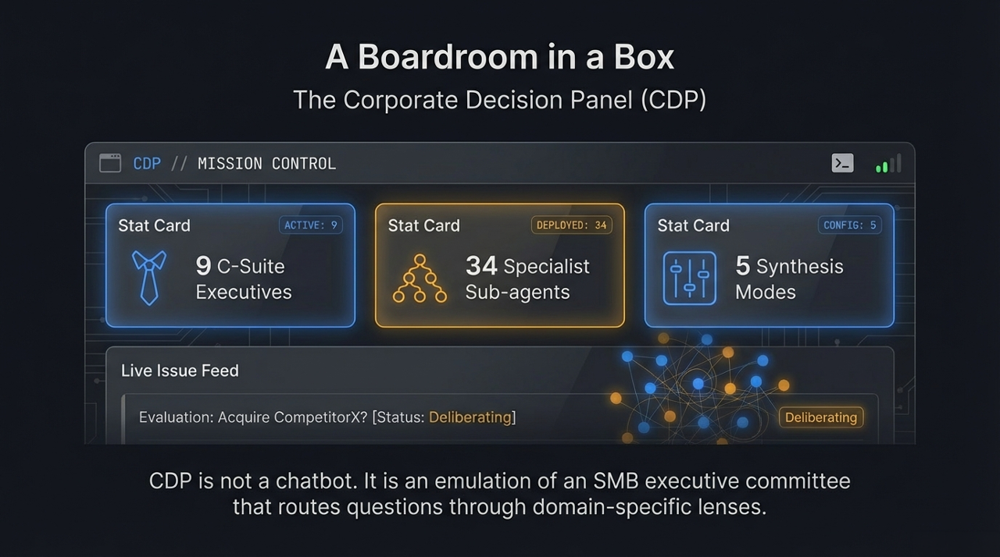

<br>

*Version 1.0 · February 2026*

</div>

---

## Table of Contents

### Part I: Introduction & Concepts
- [Chapter 1 -- What is CDP?](#chapter-1----what-is-cdp)
- [Chapter 2 -- Key Concepts](#chapter-2----key-concepts)
  - [2.1 Engagement Tiers](#21-engagement-tiers)
  - [2.2 Decision Modes](#22-decision-modes)
  - [2.3 Engineered Dissent](#23-engineered-dissent)
- [Chapter 3 -- How CDP Differs](#chapter-3----how-cdp-differs)

### Part II: Getting Started
- [Chapter 4 -- Installation](#chapter-4----installation)
- [Chapter 5 -- Quick Start](#chapter-5----quick-start)

### Part III: Commands & Usage
- [Chapter 6 -- Command Reference](#chapter-6----command-reference)
  - [`/cdp:production` -- Production Re-run](#cdpproduction----production-re-run)
- [Chapter 7 -- Decision Modes In Depth](#chapter-7----decision-modes-in-depth)

### Part IV: Architecture & Internals
- [Chapter 8 -- Agent Architecture](#chapter-8----agent-architecture)
  - [8.1 Three-Layer Hierarchy](#81-three-layer-hierarchy)
  - [8.2 Operational Isolation](#82-operational-isolation)
  - [8.3 C-Suite Roster](#83-c-suite-roster)
  - [8.4 Team Lead Roster](#84-team-lead-roster)
- [Chapter 9 -- The Five-Phase Cascade](#chapter-9----the-five-phase-cascade)

### Part V: Configuration
- [Chapter 10 -- Configuration](#chapter-10----configuration)
  - [10.1 Company Profile](#101-company-profile)
  - [10.2 Company Context](#102-company-context)
  - [10.3 API & Agent Configuration](#103-api--agent-configuration)
  - [10.4 Routing Table](#104-routing-table)

### Part VI: Output & Production
- [Chapter 11 -- Output Formats](#chapter-11----output-formats)
- [Chapter 12 -- Production Pipeline](#chapter-12----production-pipeline)

### Part VII: Reference
- [Chapter 13 -- Repository Structure](#chapter-13----repository-structure)
- [Chapter 14 -- Design Principles](#chapter-14----design-principles)
- [Closing](#closing)

---

<div align="center">

## Part I

# Introduction & Concepts

</div>

---

## Chapter 1 -- What is CDP?

Most AI-assisted decision-making follows the same pattern: you ask a single model a question, it gives you a single answer. The model is helpful, articulate, and confident. It is also a single voice -- and single voices have blind spots.

When a CEO asks a question in a real boardroom, they don't get one answer. They get the CFO saying "we can't afford it," the CTO saying "this changes everything," the CISO saying "the risk exposure is unacceptable," and the VP of Sales saying "our competitors already have this." The value isn't in any single perspective -- it's in the collision between them. Where experts disagree is where the most important information lives.

The Corporate Decision Panel solves this. CDP is a structured agent team that emulates an SMB executive committee. It doesn't generate consensus -- it engineers dissent. A CEO agent frames and routes, C-suite executives analyze through domain lenses, specialist team leads produce findings, and the CEO synthesizes a decision that addresses the strongest objections rather than averaging them away.

<div align="center">

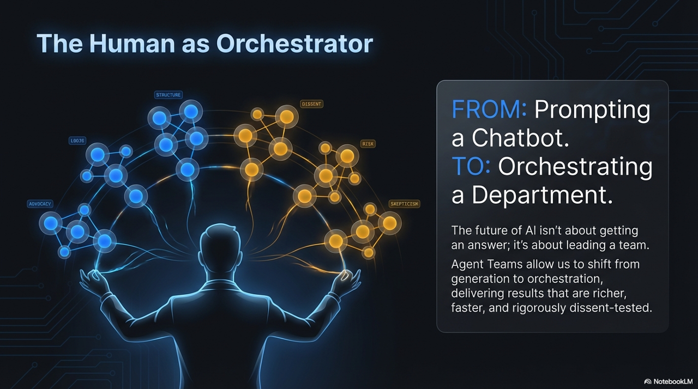

</div>

### The Problem: Single-Voice AI

You ask Claude: *"Should we build this feature in-house or buy a vendor solution?"*

You get a balanced, thoughtful answer that considers both sides. It's good. It's also generic -- it doesn't know your burn rate, your team's capacity, your compliance requirements, or that your VP of Delivery is already overcommitted on three other projects.

More fundamentally, a single-voice answer lacks structural conflict. The model can enumerate pros and cons, but it generates them from a single reasoning thread. There's no mechanism for one part of the analysis to genuinely challenge another. The answer reads coherently -- and that coherence hides the fact that certain risks were never surfaced because no one was structurally obligated to surface them.

In a real organization, the CFO doesn't list "pros and cons" -- the CFO finds the costs that aren't in the proposal. The CISO doesn't acknowledge "security considerations" -- the CISO treats every change as a threat until proven otherwise. These aren't balanced perspectives. They're adversarial ones. And that adversarial tension is what produces robust decisions.

### The Solution: Structured Agent Teams

CDP provides that adversarial tension with a structured agent team:

You run `/cdp:panel finance tech: Should we build this feature in-house or buy a vendor solution?`

The CEO frames the issue and identifies it as a Strategic/Technical hybrid. The CFO's team analyzes total cost of ownership across a 3-year horizon -- the Controller checks GAAP implications, FP&A models the cash flow impact, Treasury evaluates financing options. The CTO's team evaluates technical fit, integration complexity, and maintenance burden -- Engineering assesses build effort, Infrastructure evaluates hosting requirements, Data/Analytics checks integration compatibility.

The CFO says build (lower 3-year TCO). The CTO says buy (faster time-to-market, frees engineering capacity). They disagree -- and that disagreement is the most valuable output. The CEO identifies the fault line: this is a time-vs-money tradeoff where your current runway is the deciding factor. If you have 18+ months of runway, build. If runway is tight, buy and preserve engineering capacity for core product.

The value proposition is simple: **engineered dissent, not consensus.** Different expert perspectives, different analytical frameworks, different conclusions -- synthesized into a decision that shows you where the real tradeoffs are and which factor is most determinative for your specific situation.

CDP runs as a [Claude Code](https://docs.anthropic.com/en/docs/claude-code) agent skill.

---

## Chapter 2 -- Key Concepts

Three concepts form the foundation of CDP: **Engagement Tiers** (how deep to go), **Decision Modes** (how to weigh competing perspectives), and **Engineered Dissent** (why the roster is deliberately skeptic-heavy).

### 2.1 Engagement Tiers

Not every decision needs a full board meeting. Most SMB decisions are fast, informal, and made by one or two people. CDP matches that tempo with three engagement tiers -- from a quick hallway question to a comprehensive board deliberation.

<div align="center">

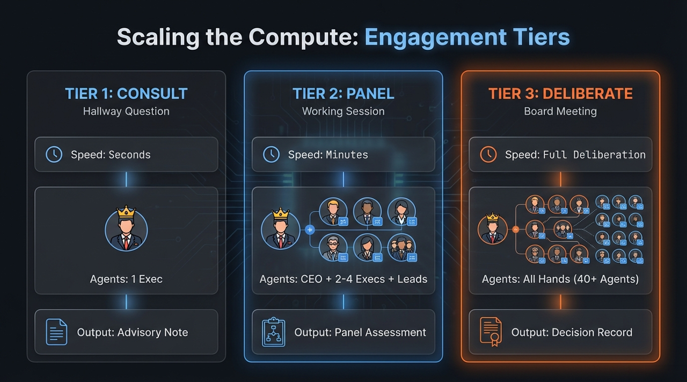

</div>

| | Tier 1: Hallway Question | Tier 2: Working Session | Tier 3: Board Meeting |
|---|---|---|---|
| **Command** | `/cdp:consult` | `/cdp:panel` | `/cdp:deliberate` |
| **Who's involved** | 1 C-suite agent | CEO + 2-4 C-suite + their team leads | CEO + all relevant C-suite + all team leads |
| **Output** | Advisory Note (3-5 sentences) | Panel Assessment (~1 page) | Decision Record (3-5 pages) |
| **Production artifacts** | Advisory Document (DOCX) | HTML, PPTX, DOCX, Results PDF, Capsule PDF | HTML, PPTX, DOCX, Results PDF, Capsule PDF |
| **Phases executed** | Direct consult only | Phase 1 → 2 → 3 → 4 → 5 | Phase 0 → 1 → 1.5? → 2 → 3 → 4 → 4.5 → 5 |
| **Pre-mortem** | No | No | Yes (Phase 4.5) |
| **CSO research** | No | If CSO activated | If CEO directs (Phase 1.5) |
| **When to use** | Quick gut-check, single-domain question | Focused multi-perspective analysis | High-stakes, irreversible, or cross-cutting decisions |

The skill defaults to lightweight engagement. Tier 1 is the daily habit; Tier 3 is the deliberate escalation. A skill that defaults to the full board meeting for every question will not see daily use.

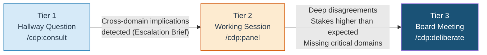
```mermaid
flowchart LR
    T1["Tier 1\nHallway Question\n/cdp:consult"]
    T2["Tier 2\nWorking Session\n/cdp:panel"]
    T3["Tier 3\nBoard Meeting\n/cdp:deliberate"]

    T1 -->|"Cross-domain implications\ndetected (Escalation Brief)"| T2
    T2 -->|"Deep disagreements\nStakes higher than expected\nMissing critical domains"| T3

    style T1 fill:#D6EAF8,stroke:#2980B9,color:#2C3E50
    style T2 fill:#FDEBD0,stroke:#D35400,color:#2C3E50
    style T3 fill:#1A5276,color:#fff
```

> **Tip:** Start with Tier 1. If the answer comes back with an Escalation Brief suggesting cross-domain implications, escalate to Tier 2. If Tier 2 reveals deep disagreements or stakes higher than expected, escalate to Tier 3. Let the system guide you upward rather than starting at the top.

### 2.2 Decision Modes

Five CEO synthesis prompt modifiers derived from established decision theory (Rowe & Boulgarides Decision Style Theory + classical operations research). Domain analysis is identical across modes -- different weighting produces different decisions from the same evidence.

<div align="center">

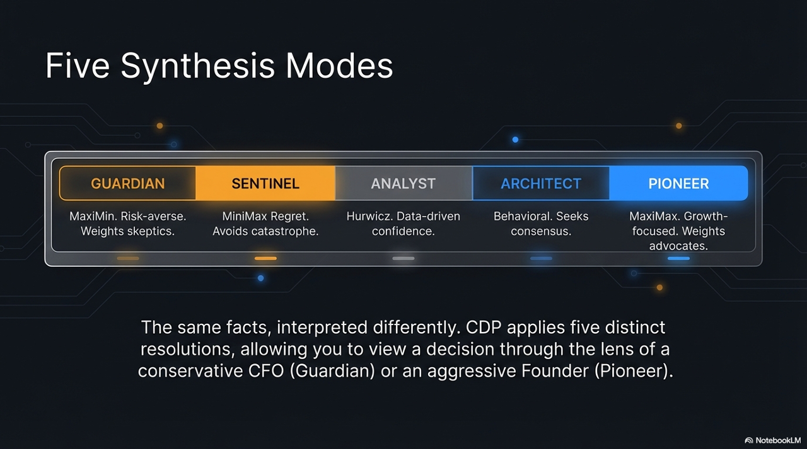

</div>

| Mode | Disposition | Decision Theory | Resolution Pattern |
|------|-------------|-----------------|-------------------|
| **Guardian** | Cautious -- would rather miss an opportunity than take a damaging risk | MaxiMin (maximize minimum outcome) | Weights skeptics (CISO, CFO, COO, VP Delivery). Skeptics must be satisfied, not just acknowledged. Tends toward: don't do it, smaller version, or extensive guardrails. |
| **Pioneer** | Growth-oriented -- biggest risk is standing still | MaxiMax (maximize maximum outcome) | Weights advocates (VP Sales, CTO). Skeptic concerns treated as engineering problems, not reasons to stop. Tends toward: do it, do it bigger, do it faster. |
| **Architect** | Consensus-builder -- decisions succeed on organizational alignment | Behavioral (optimize for buy-in) | Weights the fault lines themselves. Seeks the position satisfying the most domain concerns. Conditions drawn from multiple domains. |
| **Analyst** | Data-driven -- distrusts optimism and pessimism, trusts evidence | Hurwicz (balanced weighting by confidence) | Weights confidence levels regardless of role. High-confidence findings outweigh low-confidence regardless of source. "Defer pending better data" is legitimate. **Default mode.** |
| **Sentinel** | Regret minimizer -- "if this is wrong, can we recover?" | MiniMax Regret (minimize maximum regret) | Disproportionately weights the strongest objection from ANY role. Favors paths where being wrong is survivable over paths where being right is spectacular. |

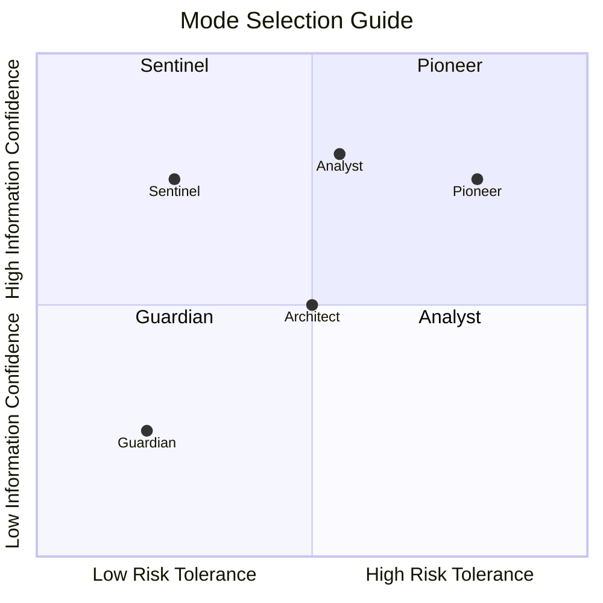
```mermaid
quadrantChart
    title Mode Selection Guide
    x-axis Low Risk Tolerance --> High Risk Tolerance
    y-axis Low Information Confidence --> High Information Confidence
    quadrant-1 Pioneer
    quadrant-2 Sentinel
    quadrant-3 Guardian
    quadrant-4 Analyst
    Pioneer: [0.80, 0.75]
    Architect: [0.50, 0.50]
    Analyst: [0.55, 0.80]
    Guardian: [0.20, 0.25]
    Sentinel: [0.25, 0.75]
```

When unsure, start with **Analyst** (the default). Use multi-mode comparison (`guardian vs pioneer`) when the decision hinges on risk appetite. Use `all-modes` for irreversible decisions to see the full spectrum.

### 2.3 Engineered Dissent

Both humans and large language models exhibit optimism bias. Left to its own devices, an AI will tend to find reasons why a plan could work rather than reasons it might fail. CDP counteracts this with a deliberately skeptic-heavy roster.

<div align="center">

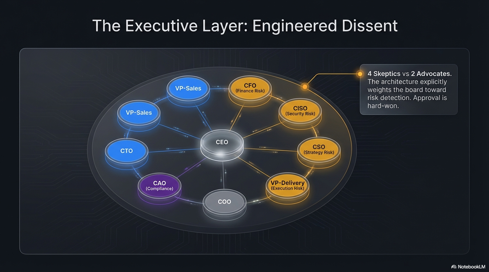

</div>

The C-suite roster consists of:

- **4 Skeptics** (COO, CFO, CISO, VP Delivery) -- surface risks, costs, and constraints
- **2 Advocates** (CTO, VP Sales) -- champion opportunity and growth
- **1 Systemic** (CAO) -- assess organizational absorption capacity
- **1 Investigative** (CSO) -- produce evidence, not opinions
- **1 Synthesizer** (CEO) -- weigh, judge, decide

This is not a bug -- it's the design. In a real boardroom, the people responsible for operations, money, security, and delivery tend to be more cautious than the people responsible for technology and sales. The skeptic-heavy ratio reflects organizational reality.

Advocates carry a mandatory mitigation: they must name the strongest objection to their own position and explain why they still advocate despite it. This forces honest advocacy -- you can't champion a position without acknowledging its risks.

The result is that every CDP decision surfaces objections at full strength. Disagreement is signal, not noise. The CEO doesn't average perspectives into a bland middle ground -- the CEO identifies fault lines, determines which perspective is most determinative for this specific issue, and makes a decision that addresses the strongest objections.

---

## Chapter 3 -- How CDP Differs

There are three approaches to using AI for complex analysis: single-threaded prompting, agent swarms, and structured agent teams. CDP takes the third approach -- and the differences matter.

<div align="center">

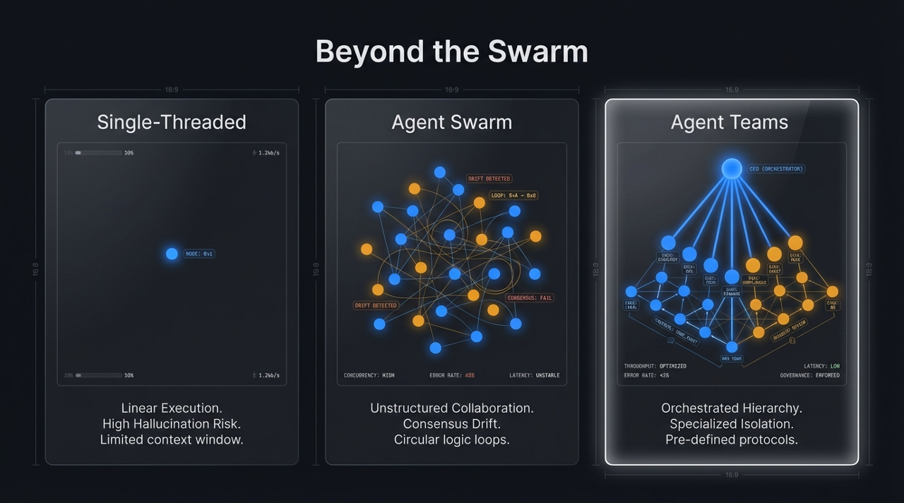

</div>

### Single-Threaded Prompting

You ask one model one question and get one answer. The model is capable of nuance, but it generates that nuance from a single reasoning thread. There's no structural mechanism for one part of the analysis to challenge another. The model's blind spots are your blind spots -- and you won't know what's missing because the answer reads coherently.

The fundamental limitation isn't capability -- it's architecture. A single model can reason about finance, technology, operations, and security. But it reasons about them sequentially, from a single perspective, and it self-edits as it goes. By the time it reaches its conclusion, the internal contradictions have been smoothed away. You never see the CFO's "we can't afford this" collide with the CTO's "we can't afford not to" because those perspectives were never structurally independent.

### Agent Swarms

Multiple agents collaborate on a task, but without predetermined structure. Swarms excel at open-ended exploration where the problem space is unknown. They struggle with decision-making because there's no built-in mechanism for weighting competing perspectives, no hierarchy to synthesize disagreements, and no separation between analysis and judgment.

In a swarm, agents may duplicate each other's work, miss entire domains because no one was assigned to cover them, or produce contradictory analyses with no mechanism for resolving the contradiction. The swarm model works well for research and creative exploration -- it works poorly for structured decision-making where coverage guarantees, adversarial tension, and hierarchical synthesis matter.

### Structured Agent Teams (CDP)

CDP uses a fixed organizational structure with predetermined roles, dispositions, and information flows. This structure is the product:

- **Roles create coverage.** Each domain has dedicated analytical capacity with specialized team leads. Nothing falls through the cracks because someone is responsible for every lens.
- **Dispositions create tension.** Skeptics and advocates are built to disagree. The disagreement isn't emergent -- it's engineered.
- **Hierarchy creates synthesis.** Raw findings flow through domain synthesis (C-suite) before reaching the decision-maker (CEO). Two-tier visibility prevents cherry-picking.
- **Modes create optionality.** The same evidence can produce five different decisions depending on how you weigh risk, opportunity, and uncertainty.

<div align="center">

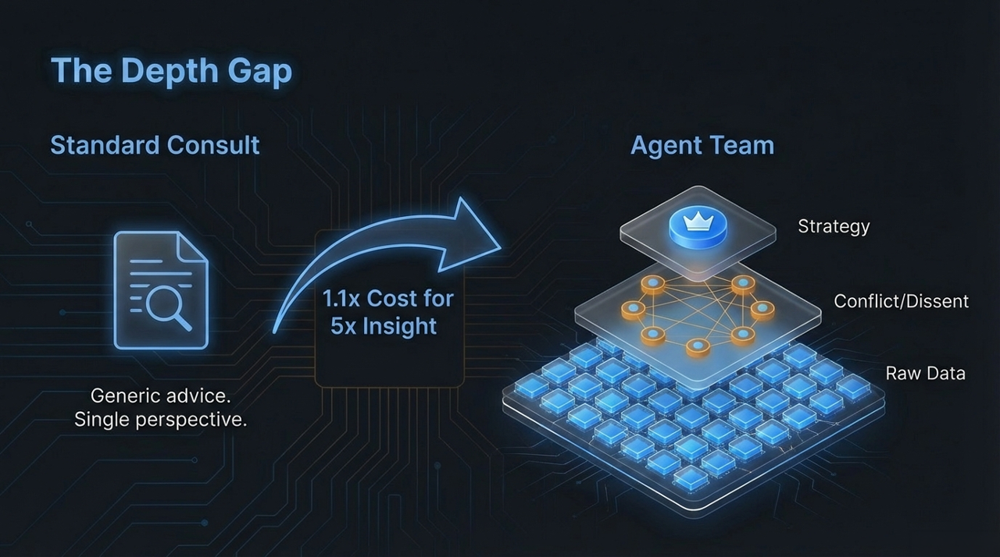

</div>

### Multi-Mode Cost Efficiency

Domain analysis is mode-independent. When you run a multi-mode comparison, the expensive part (team lead analysis, C-suite synthesis) runs once. Only the CEO synthesis -- a single-agent pass -- runs per mode.

**Cost: approximately 1.1x a single deliberation for up to 5x the strategic insight.**

Consider what this means in practice. A single Tier 3 deliberation activates team leads, C-suite agents, and the CEO -- dozens of agent calls producing domain analysis. Running all five modes adds only five more CEO synthesis passes. You get five complete decisions -- each reflecting a different philosophical orientation toward risk and opportunity -- for nearly the same cost as one.

The real payoff is **Mode Sensitivity**: if all five modes produce the same decision, the evidence speaks for itself regardless of risk appetite. That's a powerful signal -- it means reasonable people with very different risk tolerances would all reach the same conclusion. If modes diverge dramatically, the deciding factor isn't the analysis -- it's your personal risk appetite. And knowing that the analysis doesn't determine the answer, but your values do, is itself the most important insight.

### Model Diversity as Robustness

CDP deliberately uses three different model tiers (Opus, Sonnet, Haiku) across its hierarchy. This isn't just a cost optimization -- it's a robustness strategy. If a single model has systematic biases or blind spots, distributing reasoning across model families reduces the chance that one model's weakness becomes the system's weakness.

Opus handles cross-domain synthesis where reasoning quality is paramount. Sonnet handles domain decomposition where capability and cost must balance. Haiku handles narrow specialist analysis where volume and parallelism matter most. Each model tier is matched to the cognitive demands of its role -- you wouldn't use Opus for 34 parallel team lead analyses (expensive and unnecessary), and you wouldn't use Haiku for the CEO's final synthesis (insufficient reasoning depth).

---

<div align="center">

## Part II

# Getting Started

</div>

---

## Chapter 4 -- Installation

### Prerequisites

- [Claude Code](https://docs.anthropic.com/en/docs/claude-code) installed and configured
- Git
- Python 3.6+
- For production artifacts (optional): Node.js with `pptxgenjs` and `docx` npm packages, Python `reportlab` + `Pillow` (Results PDF), `weasyprint` (Capsule PDF)

### Project-Level Install

Clone into your project's `.claude/skills/` directory and run the installer:

```bash
mkdir -p .claude/skills
git clone https://github.com/apatheticus/corporate-decision-panel .claude/skills/corporate-decision-panel
python3 .claude/skills/corporate-decision-panel/install.py
```

The installer copies agent definitions and slash commands into your project's `.claude/` directory so they're available immediately when you start Claude Code. If you skip the installer, CDP will auto-setup on first use -- but slash commands won't be available until you restart the session.

### Global Install (All Projects)

```bash
mkdir -p ~/.claude/skills
git clone https://github.com/apatheticus/corporate-decision-panel ~/.claude/skills/corporate-decision-panel
python3 ~/.claude/skills/corporate-decision-panel/install.py
```

### Update

```bash
cd .claude/skills/corporate-decision-panel && git pull && python3 install.py
```

### What the Installer Does

The installer performs five actions:

1. **Copies agent definitions** from `agents/` to `.claude/agents/`, preserving the directory structure (`c-suite/`, `team-leads/`)
2. **Copies slash commands** from `commands/` to `.claude/commands/`, preserving the directory structure (`cdp/`)
3. **Updates `.gitignore`** to exclude `.cdp-output/` and `.cdp-context/` if not already present
4. **Creates `.cdp-context/`** directory if it doesn't exist
5. **Seeds `.cdp-context/` with templates** -- copies `company.md`, `style.md`, and `config.md` from `templates/` (skips any file already present, so your customizations are never overwritten)

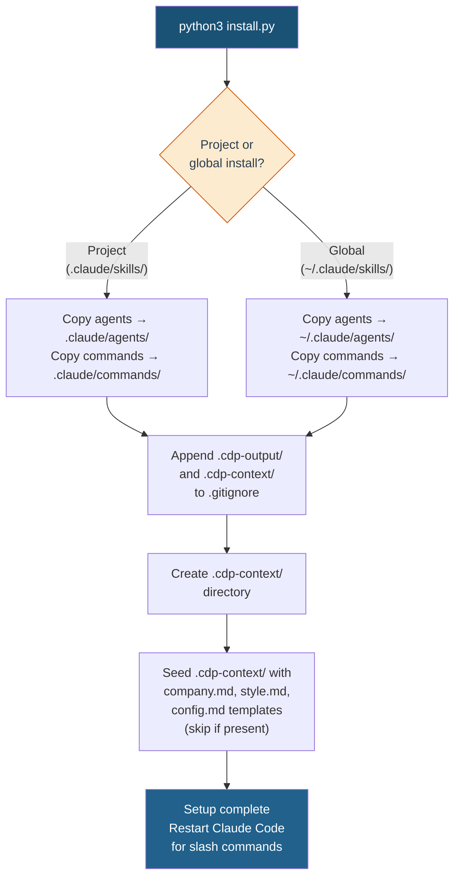
```mermaid
flowchart TD
    Start["python3 install.py"] --> Check{"Project or\nglobal install?"}

    Check -->|"Project\n(.claude/skills/)"| ProjCopy["Copy agents → .claude/agents/\nCopy commands → .claude/commands/"]
    Check -->|"Global\n(~/.claude/skills/)"| GlobCopy["Copy agents → ~/.claude/agents/\nCopy commands → ~/.claude/commands/"]

    ProjCopy --> GitIgnore["Append .cdp-output/\nand .cdp-context/\nto .gitignore"]
    GlobCopy --> GitIgnore

    GitIgnore --> MkDir["Create .cdp-context/\ndirectory"]
    MkDir --> Seed["Seed .cdp-context/ with\ncompany.md, style.md,\nconfig.md templates\n(skip if present)"]
    Seed --> Done["Setup complete\nRestart Claude Code\nfor slash commands"]

    style Start fill:#1A5276,color:#fff
    style Done fill:#21618C,color:#fff
    style Check fill:#FDEBD0,stroke:#D35400,color:#2C3E50
```

### Verification

After installation, verify that the setup is complete:

```bash
# Check agent definitions exist
ls .claude/agents/ceo.md

# Check slash commands exist
ls .claude/commands/cdp/consult.md

# Check C-suite agents
ls .claude/agents/c-suite/

# Check team lead agents
ls .claude/agents/team-leads/
```

Then start Claude Code and run a quick test:

```
/cdp:consult cfo: Can we afford to hire this quarter?
```

If the CFO agent responds with an Advisory Note, the installation is complete.

> **Note:** Slash commands (`/cdp:consult`, `/cdp:panel`, etc.) require a Claude Code restart to become available. If you installed without restarting, the auto-setup fallback will still work, but slash commands won't appear in tab completion until the next session.

> **Important:** If you're using a global install (`~/.claude/skills/`) and a project-level install (`.claude/skills/`) simultaneously, the project-level install takes precedence. This allows project-specific customizations to override global defaults.

---

## Chapter 5 -- Quick Start

Getting started with CDP is straightforward. Begin with Tier 1 (the lightest engagement), and let the system guide you toward deeper analysis when the issue warrants it.

<div align="center">

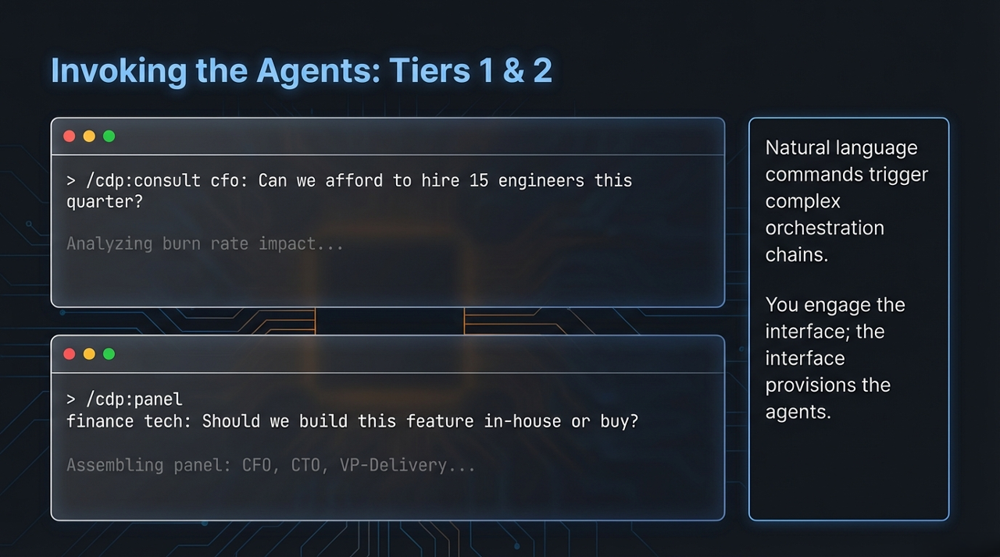

</div>

### Your First Consult (Tier 1)

Start with a quick hallway question -- a single C-suite agent, a single perspective, a few seconds:

```
/cdp:consult cfo: Can we afford to hire 15 engineers this quarter?
```

The CFO agent runs an internal checklist (considering what each of their team leads would flag -- Controller checks budget capacity, FP&A checks cash flow projections, Treasury checks available funds), then delivers an Advisory Note in 3-5 sentences with a confidence level. If cross-domain implications are detected, an Escalation Brief is appended suggesting which other domains should weigh in.

Try different roles for different questions:

```
/cdp:consult cto: Should we migrate from AWS to GCP?
/cdp:consult ciso: Is this vendor's SOC 2 report sufficient?
/cdp:consult vp-delivery: Can we absorb this new project given current commitments?
/cdp:consult cao: What are the HR implications of moving to a 4-day work week?
```

### Your First Panel (Tier 2)

When you need multiple perspectives, convene a working session:

```
/cdp:panel finance tech: Should we build this feature in-house or buy?
```

The CEO frames the issue, routes it to the CFO and CTO, their team leads produce findings, the C-suite agents synthesize domain recommendations, and the CEO produces a Panel Assessment (~1 page) that identifies where finance and technology agree, where they disagree, and what that means for the decision.

### Your First Deliberation (Tier 3)

For high-stakes, irreversible, or cross-cutting decisions, run the full board:

```
/cdp:deliberate: Should we pivot to a platform model?
```

Full five-phase cascade: shared consciousness broadcast, CEO framing and routing, optional CSO research investigation, all relevant C-suite activated with team lead delegation, pre-mortem challenge, and complete CEO deliberation. Produces a Decision Record (3-5 pages) and triggers the full production pipeline (HTML briefing, PPTX presentation, DOCX report, PDFs).

### Auto-Triage

Not sure which tier? Let the CEO assess:

```
/cdp:evaluate: Should we acquire CompetitorX?
```

The CEO evaluates scope (single-domain / multi-domain / cross-cutting), impact (low / medium / high / critical), and reversibility (easily reversed / difficult / irreversible), then recommends a tier and mode with rationale. You accept, override, or select a different configuration.

### Practical Tips for Getting Started

> **Tip:** Start with Tier 1. It's fast, cheap, and the Escalation Brief will tell you if you need to go deeper. Most daily business questions are well-served by a quick consult. Reserve Tier 3 for the decisions that keep you up at night.

> **Tip:** Set up your Company Context file (`.cdp-context/company.md`) before running your first Tier 2 or Tier 3 deliberation. The difference between generic analysis and analysis grounded in your actual numbers is substantial. Even partial data (just revenue, headcount, and tech stack) significantly improves the quality of domain recommendations.

> **Tip:** For your first Tier 3 deliberation, choose an issue your team has recently debated. Compare the CDP output to your actual decision process. This builds calibration -- you'll see where CDP adds value and where it needs more company context.

---

<div align="center">

## Part III

# Commands & Usage

</div>

---

## Chapter 6 -- Command Reference

CDP provides four commands, each corresponding to a different level of engagement. Each command accepts the issue or question as natural language after a colon. Modes and roles are specified before the colon. The following decision tree helps you choose:

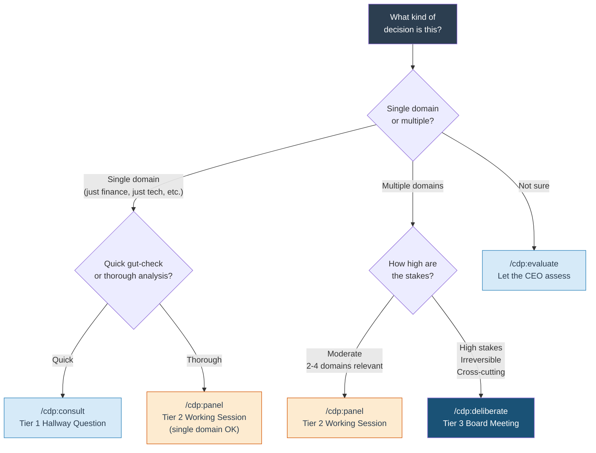
```mermaid
flowchart TD
    Start["What kind of\ndecision is this?"] --> Q1{"Single domain\nor multiple?"}

    Q1 -->|"Single domain\n(just finance, just tech, etc.)"| Q2{"Quick gut-check\nor thorough analysis?"}
    Q1 -->|"Multiple domains"| Q3{"How high are\nthe stakes?"}
    Q1 -->|"Not sure"| Eval["/cdp:evaluate\nLet the CEO assess"]

    Q2 -->|"Quick"| T1["/cdp:consult\nTier 1 Hallway Question"]
    Q2 -->|"Thorough"| T2P["/cdp:panel\nTier 2 Working Session\n(single domain OK)"]

    Q3 -->|"Moderate\n2-4 domains relevant"| T2["/cdp:panel\nTier 2 Working Session"]
    Q3 -->|"High stakes\nIrreversible\nCross-cutting"| T3["/cdp:deliberate\nTier 3 Board Meeting"]

    style Start fill:#2C3E50,color:#fff
    style T1 fill:#D6EAF8,stroke:#2980B9,color:#2C3E50
    style T2 fill:#FDEBD0,stroke:#D35400,color:#2C3E50
    style T2P fill:#FDEBD0,stroke:#D35400,color:#2C3E50
    style T3 fill:#1A5276,color:#fff
    style Eval fill:#D6EAF8,stroke:#2980B9,color:#2C3E50
```

### `/cdp:consult` -- Tier 1 Hallway Question

Quick, opinionated consult with one C-suite agent. No CEO, no routing, no team leads. Produces an Advisory Note (3-5 sentences) and an Advisory Document (DOCX).

**Syntax:**

```
/cdp:consult [role] [mode?]: [question]
```

**Parameters:**

| Parameter | Required | Description |
|-----------|----------|-------------|
| `role` | Yes | C-suite agent to consult (see [Available Roles](#available-roles)) |
| `mode` | No | Decision mode (defaults to Analyst) |

**Examples:**

```
/cdp:consult cfo: Can we afford to hire 15 engineers this quarter?
/cdp:consult ciso guardian: What are the risks of this vendor integration?
/cdp:consult vp-sales pioneer: How does this feature help us sell more?
/cdp:consult cto: Should we migrate to Kubernetes?
```

**Output:** Advisory Note (3-5 sentences) delivered in the conversation, plus an Advisory Document (DOCX) written to the session output directory.

**Behavior:** The agent runs an internal checklist, considering what each of their team leads would flag. If cross-domain implications are detected, an Escalation Brief is appended to the Advisory Note suggesting which domains should weigh in.

### `/cdp:panel` -- Tier 2 Working Session

CEO frames and routes to 2-4 C-suite members. Full domain analysis with team lead delegation. CEO produces lightweight synthesis. Produces a Panel Assessment (~1 page). Production pipeline always triggers.

**Syntax:**

```
/cdp:panel [mode?] [roles]: [issue]
```

**Parameters:**

| Parameter | Required | Description |
|-----------|----------|-------------|
| `roles` | Yes | 2-4 C-suite roles or domain shorthands (e.g., `finance tech`) |
| `mode` | No | Decision mode (defaults to Analyst) |

**Examples:**

```
/cdp:panel finance tech: Should we build this feature in-house?
/cdp:panel pioneer finance tech sales: Should we acquire CompetitorX?
/cdp:panel operations delivery: Should we restructure the PMO?
/cdp:panel guardian finance: Should we take on more debt?
```

**Output:** Panel Assessment (~1 page) delivered in the conversation, plus production artifacts (HTML, PPTX, DOCX, Results PDF, Capsule PDF).

**Behavior:** The CEO frames the issue, classifies the decision type, and routes to the specified roles. Each activated C-suite agent creates a division team, spawns team leads as teammates in parallel, collects findings via SendMessage, and synthesizes a domain recommendation. The CEO collects all domain recommendations and produces the Panel Assessment.

### `/cdp:deliberate` -- Tier 3 Board Meeting

Full five-phase cascade. All relevant C-suite activated via routing table. Full team lead analysis. Pre-mortem challenge. Complete CEO deliberation. Produces a Decision Record (3-5 pages). Production always triggered.

**Syntax:**

```
/cdp:deliberate [mode?]: [issue]
```

**Parameters:**

| Parameter | Required | Description |
|-----------|----------|-------------|
| `mode` | No | Decision mode, multi-mode comparison, or `all-modes` |

**Examples:**

```
/cdp:deliberate: Should we pivot to a platform model?
/cdp:deliberate guardian: Should we take on $10M in debt for expansion?
/cdp:deliberate guardian vs pioneer: Should we enter the enterprise market?
/cdp:deliberate all-modes: Should we acquire CompetitorX?
```

**Output:** Decision Record (3-5 pages) delivered in the conversation, plus production artifacts (HTML, PPTX, DOCX, Results PDF, Capsule PDF).

**Behavior:** The full cascade executes: Phase 0 (shared consciousness), Phase 1 (CEO framing and routing), Phase 1.5 (CSO research, if activated), Phase 2 (C-suite dispatches downward), Phase 3 (team leads produce findings), Phase 4 (C-suite synthesizes upward), Phase 4.5 (pre-mortem challenge), and Phase 5 (CEO deliberation and Decision Record). See [Chapter 9 -- The Five-Phase Cascade](#chapter-9----the-five-phase-cascade) for detailed descriptions of each phase.

### `/cdp:evaluate` -- Auto-Triage

CEO assesses the issue and recommends a tier, mode, and routing. You accept, override, or select a different configuration.

**Syntax:**

```
/cdp:evaluate: [issue]
```

**Output format:**

```
ISSUE TRIAGE: [Issue Title]
Scope: [single-domain | multi-domain | cross-cutting]
Impact: [low | medium | high | critical]
Reversibility: [easily reversed | difficult | irreversible]
Recommended Tier: [tier] -- [rationale]
Recommended Mode: [mode] -- [rationale]
Alternative: [mode] -- [what it would reveal]
```

**Behavior:** The CEO evaluates three dimensions -- scope, impact, and reversibility -- and produces a recommendation. The auto-triage leans toward Tier 1 unless clear multi-domain signals are present, reflecting the SMB-first design bias.

**How the three dimensions map to tiers:**

| Scope | Impact | Reversibility | Typical Recommendation |
|-------|--------|---------------|----------------------|
| Single-domain | Low-Medium | Easily reversed | Tier 1 |
| Multi-domain | Medium | Difficult | Tier 2 |
| Cross-cutting | High-Critical | Irreversible | Tier 3 |

The CEO also recommends a mode based on the decision characteristics (see [CEO Mode Recommendation](#ceo-mode-recommendation-auto-triage) in Chapter 7) and suggests an alternative mode that would reveal a different dimension of the decision.

### `/cdp:production` -- Production Re-run

Re-run only the production pipeline for an existing session using the persisted `RECORD.md`. Does not re-run the deliberation cascade. Use this when images fail (generation errors) or outputs have errors -- no need to re-run the expensive analytical phases.

**Syntax:**

```
/cdp:production [session-path?]
```

**Parameters:**

| Parameter | Required | Description |
|-----------|----------|-------------|
| `session-path` | No | Path to session directory, slug substring, or omit for most recent |

**Session resolution order:**
1. Explicit path → validate it contains `RECORD.md`
2. Slug substring match → scan `.cdp-output/*/RECORD.md`, disambiguate if multiple matches
3. No argument → most recent session (by date prefix)
4. No sessions found → error with example invocations

**Examples:**

```
/cdp:production                                                  # Most recent session
/cdp:production .cdp-output/2026-02-28_should-we-acquire-competitor-x/
/cdp:production acquire-competitor                               # Fuzzy slug match
```

**Behavior:** The orchestrator reads the persisted `RECORD.md` from the session directory, extracts session metadata from the YAML frontmatter, cleans stale artifacts (preserving `RECORD.md` and `build/`), and spawns the production pipeline using the record body as input. Production agents behave identically regardless of original vs. re-run invocation.

**Error cases:**
- **No `RECORD.md`**: "This session predates the `/cdp:production` feature. Re-run the original deliberation command to generate production artifacts and a RECORD.md for future re-runs."
- **No `.cdp-output/` directory**: "No CDP sessions found. Run a deliberation first."
- **Multiple slug matches**: Lists matching sessions with metadata and asks for disambiguation.

### Multi-Mode Syntax

Domain analysis runs once. CEO synthesis runs per mode. Cost: approximately 1.1x a single deliberation for up to 5x the strategic insight.

**Single mode** (applies one synthesis philosophy):

```
/cdp:deliberate guardian: Should we take on $10M in debt?
/cdp:consult cfo guardian: Can we afford this?
/cdp:panel pioneer finance tech: Should we acquire CompetitorX?
```

**Two-mode comparison** (shows the spectrum between two philosophies):

```
/cdp:deliberate guardian vs pioneer: Should we enter the enterprise market?
```

**Three-mode comparison** (fine-grained analysis):

```
/cdp:deliberate guardian vs analyst vs sentinel: Should we restructure?
```

**All-modes comparison** (maximum insight -- recommended for irreversible decisions):

```
/cdp:deliberate all-modes: Should we acquire CompetitorX?
```

Multi-mode produces a **Comparative Decision Record** with shared analysis, per-mode synthesis, divergence analysis, and a **Mode Sensitivity** rating. Mode Sensitivity is a novel signal: if all modes produce the same decision, the evidence speaks for itself regardless of risk appetite. If modes diverge dramatically, the user's personal risk appetite is the deciding factor, not the analysis.

> **Tip:** The most common multi-mode comparison is `guardian vs pioneer`. This shows you the full spectrum from "protect against downside" to "capture the upside" and reveals whether the decision is evidence-driven or values-driven. Use `all-modes` for irreversible decisions where you want to see the complete picture.

### Available Roles

`ceo` `coo` `cfo` `cto` `ciso` `cao` `vp-sales` `vp-delivery` `cso`

Domain shorthands for `/cdp:panel` (for convenience when specifying roles):

| Shorthand | Maps To | Domain Coverage |
|-----------|---------|-----------------|
| `finance` | CFO | Budget, cash flow, TCO, tax, AP/AR |
| `tech` | CTO | Engineering, infrastructure, data, product/UX |
| `operations` | COO | Process, quality, vendor/procurement, facilities |
| `security` | CISO | Security ops, compliance/GRC, identity, architecture |
| `sales` | VP Sales | Sales ops, accounts, business dev, enablement |
| `delivery` | VP Delivery | Projects, resources, client success, QA |
| `admin` | CAO | HR, legal, policy, corporate comms |
| `research` | CSO | Market intel, competitive intel, tech scouting, regulatory |

---

## Chapter 7 -- Decision Modes In Depth

The five decision modes are the heart of CDP's flexibility. Each mode represents a different philosophical orientation toward risk, opportunity, and uncertainty. The domain analysis is always the same -- what changes is how the CEO weighs competing perspectives when they inevitably disagree.

Understanding the modes deeply helps you choose the right one for each decision. The following sections describe each mode's philosophy, resolution pattern, and practical guidance. Each section includes "best for" and "watch out for" advice to help you select appropriately.

> **Important:** Modes don't change what evidence is gathered -- they change how evidence is weighed. A Guardian CEO and a Pioneer CEO see the same domain analyses and the same fault lines. They reach different conclusions because they apply different values to the same facts. This is by design.

### Guardian (MaxiMin -- Risk-Averse)

**Description:** The Guardian CEO is cautious by disposition. They'd rather miss an opportunity than take a risk that could damage the business. When skeptic and advocate perspectives conflict, the Guardian leans toward the skeptics unless advocates present overwhelming evidence of low-risk upside.

**Theory basis:** MaxiMin decision criterion -- maximize the minimum outcome. Of all possible paths, choose the one where the worst case is least bad.

**Resolution pattern:** Skeptic roles (CISO, CFO, COO, VP Delivery) are weighted more heavily. Their concerns must be satisfied, not just acknowledged. The Guardian frames conditions and guardrails as non-negotiable prerequisites, not optional recommendations.

**Best for:**
- Decisions with significant downside risk
- Situations where the company can't afford to be wrong
- Regulated environments where compliance failures are catastrophic
- Cash-constrained companies where a bad bet could be existential

**Watch out for:** Guardian can be overly conservative. If the evidence genuinely supports action, Guardian may still recommend against it because the downside, however unlikely, is severe. Use Pioneer as a counterpoint to check whether Guardian is seeing risks that aren't there.

### Pioneer (MaxiMax -- Growth-Oriented)

**Description:** The Pioneer CEO is growth-oriented. They believe the biggest risk is standing still while competitors move. Skeptic concerns are treated as implementation challenges to solve, not objections to honor.

**Theory basis:** MaxiMax decision criterion -- maximize the maximum outcome. Of all possible paths, choose the one with the highest upside potential.

**Resolution pattern:** Advocate roles (VP Sales, CTO) are weighted more heavily. When advocates identify opportunity, the Pioneer looks for ways to accelerate capture rather than reasons to delay. A strong objection means "solve this problem," not "abandon this path."

**Best for:**
- Growth-stage decisions where speed matters
- Competitive situations where first-mover advantage is real
- Decisions where inaction has clear costs (market share erosion, talent flight)
- Innovation initiatives where the upside justifies calculated risk

**Watch out for:** Pioneer can underweight genuine risks by treating them as solvable engineering problems. Not all risks are solvable. Use Guardian as a counterpoint to test whether the objections Pioneer is dismissing are real constraints.

### Architect (Behavioral -- Consensus-Building)

**Description:** The Architect CEO is a consensus-builder. They believe decisions succeed or fail based on organizational alignment -- a brilliant decision no one will implement is worse than a good decision everyone supports.

**Theory basis:** Behavioral decision theory -- optimize for organizational buy-in and implementation success.

**Resolution pattern:** Weights the fault lines themselves. Seeks the position that satisfies the most domain concerns, even if it means a less aggressive or less cautious path. Conditions are drawn from multiple domains, not just the most determinative one.

**Best for:**
- Decisions requiring broad organizational support to succeed
- Change management initiatives where resistance is the primary risk
- Situations with multiple strong competing priorities
- Decisions where implementation quality depends on team commitment

**Watch out for:** Architect can produce compromise positions that satisfy no one fully. Sometimes the right answer is decisive action in one direction, not a middle path. Use Pioneer or Guardian to check whether the consensus position is actually the best one.

### Analyst (Hurwicz -- Data-Driven, Default)

**Description:** The Analyst CEO distrusts both optimism and pessimism -- they trust evidence. Recommendations are weighted by confidence level, not enthusiasm or caution. "Defer pending better data" is a legitimate outcome.

**Theory basis:** Hurwicz criterion -- balanced weighting between optimistic and pessimistic outcomes, adjusted by the confidence of the underlying analysis.

**Resolution pattern:** Weights confidence levels regardless of role disposition. High-confidence findings from any role outweigh low-confidence findings from any other role. Low-confidence recommendations are flagged as needing more research. The Analyst flags which specific data gaps, if filled, would change the analysis.

**Best for:**
- Data-rich environments where evidence quality varies
- Situations where the team disagrees about the facts, not just the interpretation
- Decisions where deferral is genuinely an option (not time-pressured)
- Default mode for most decisions -- it's the least opinionated starting point

**Watch out for:** Analyst can over-index on deferral. Sometimes you have to decide with imperfect information. If Analyst keeps recommending "investigate further," check whether the remaining uncertainty actually matters to the decision. Use Sentinel to ask "if we're wrong, can we recover?"

### Sentinel (MiniMax Regret -- Regret-Minimizing)

**Description:** The Sentinel CEO is a regret minimizer. For every option, they ask: "If this turns out to be wrong, can we recover?" The Sentinel disproportionately weights the strongest objection from any role -- not because it's most likely, but because being wrong about it would be most damaging.

**Theory basis:** MiniMax Regret -- minimize the maximum regret across all possible outcomes.

**Resolution pattern:** Identifies the single strongest objection from any domain and asks: "If this goes wrong, which C-suite member's warning will I wish I'd heeded?" Favors paths where being wrong is survivable, even if being right is less spectacular.

**Best for:**
- Irreversible decisions (acquisitions, divestitures, platform decommissions)
- Situations where the company needs to survive being wrong
- Decisions with asymmetric downside (low probability, catastrophic impact)
- Existential risk scenarios

**Watch out for:** Sentinel can be paralyzed by worst-case thinking. If every path has a scary worst case, Sentinel may struggle to recommend any action. Use Pioneer to check whether the worst cases Sentinel is worried about are actually plausible.

### Mode/Tier Interaction Matrix

Each mode produces distinct behavioral patterns at each engagement tier:

|  | Tier 1 (Hallway Question) | Tier 2 (Working Session) | Tier 3 (Board Meeting) |
|--|--------------------------|------------------------|----------------------|
| **Guardian** | Highlights downside risks, suggests what could go wrong | Synthesis biased toward risk mitigation. Extensive guardrails. | CEO weights skeptics heavily. High bar for approval. |
| **Pioneer** | Frames as investment question, suggests acceleration | Synthesis biased toward opportunity capture. "How to" not "whether to." | CEO weights advocates heavily. Low bar unless existential risk. |
| **Architect** | Includes "however, [other role] might see this differently" | Seeks option addressing most concerns across all activated roles. | CEO seeks widest organizational support. Conditions from all domains. |
| **Analyst** | Flags confidence level explicitly. Low-confidence = research recommendation. | Synthesis driven by which domains have highest-confidence findings. | CEO weights by evidence quality. Low-confidence = "investigate further." |
| **Sentinel** | Identifies the single biggest risk and whether it's survivable. | Identifies strongest objection across all activated roles. Tests whether downside is recoverable. | CEO disproportionately weights the strongest single objection. Favors survivable paths. |

<sub>Default cell: Tier 1 + Analyst -- quick, evidence-weighted, transparent about uncertainty.</sub>

### CEO Mode Recommendation (Auto-Triage)

When the CEO triages via `/cdp:evaluate`, mode recommendation is based on decision characteristics:

| Characteristic | Recommended Mode |
|---------------|-----------------|
| High irreversibility | Sentinel or Guardian |
| High growth opportunity | Pioneer |
| High organizational complexity | Architect |
| Low data availability | Analyst (with "investigate further" likely outcome) |
| Multiple strong competing priorities | Architect |
| Existential risk | Sentinel |

### Choosing Your Mode: A Step-by-Step Guide

Most users should follow this simple process:

1. **Start with Analyst** (the default) for your first pass. It's the least opinionated and gives you a baseline. If you don't specify a mode, you get Analyst.

2. **Ask: "What am I most worried about?"**
   - If the answer is "taking a bad risk" → try **Guardian**
   - If the answer is "missing an opportunity" → try **Pioneer**
   - If the answer is "the team won't support this" → try **Architect**
   - If the answer is "we can't afford to be wrong" → try **Sentinel**
   - If the answer is "I'm not sure" → stick with **Analyst**

3. **Use multi-mode comparison** for high-stakes decisions. Run `guardian vs pioneer` to see the full spectrum, or `all-modes` for maximum insight. Multi-mode comparison is especially valuable when you suspect the decision depends more on values than on facts.

4. **Check Mode Sensitivity.** If all modes agree, the evidence is decisive -- proceed with confidence. If they diverge, the decision depends on your risk appetite. That divergence is itself the most important output, because it tells you that no amount of additional analysis will resolve the question -- only your judgment will.

5. **Iterate if needed.** If Analyst recommends "defer pending better data," consider running with Pioneer or Guardian to see what the decision would be if you had to decide today. Sometimes the Analyst's request for more data is legitimate; sometimes it's avoidance of a genuinely hard judgment call.

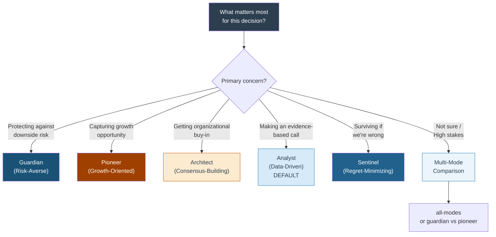
```mermaid
flowchart TD
    Start["What matters most\nfor this decision?"] --> Q1{"Primary concern?"}

    Q1 -->|"Protecting against\ndownside risk"| Guardian["Guardian\n(Risk-Averse)"]
    Q1 -->|"Capturing growth\nopportunity"| Pioneer["Pioneer\n(Growth-Oriented)"]
    Q1 -->|"Getting organizational\nbuy-in"| Architect["Architect\n(Consensus-Building)"]
    Q1 -->|"Making an evidence-\nbased call"| Analyst["Analyst\n(Data-Driven)\nDEFAULT"]
    Q1 -->|"Surviving if\nwe're wrong"| Sentinel["Sentinel\n(Regret-Minimizing)"]
    Q1 -->|"Not sure /\nHigh stakes"| Multi["Multi-Mode\nComparison"]

    Multi --> All["all-modes\nor guardian vs pioneer"]

    style Start fill:#2C3E50,color:#fff
    style Guardian fill:#1A5276,color:#fff
    style Pioneer fill:#A04000,color:#fff
    style Architect fill:#FDEBD0,stroke:#D35400,color:#2C3E50
    style Analyst fill:#D6EAF8,stroke:#2980B9,color:#2C3E50
    style Sentinel fill:#21618C,color:#fff
    style Multi fill:#EBF5FB,stroke:#2980B9,color:#2C3E50
```

---

<div align="center">

## Part IV

# Architecture & Internals

</div>

---

## Chapter 8 -- Agent Architecture

CDP's architecture mirrors a real organizational hierarchy: a CEO at the top making cross-domain judgments, C-suite executives managing domain-level analysis, and team leads performing narrow specialist work. This isn't just a metaphor -- the hierarchy determines information flow, visibility boundaries, and the quality of the final synthesis.

### 8.1 Three-Layer Hierarchy

CDP uses a three-layer model hierarchy that maps organizational structure to model capability. Each layer uses a different model tier, balancing reasoning quality with cost efficiency. Agents are organized into **Agent Teams**: the CEO leads the executive team (Layer 1), each C-suite agent leads a division team of team leads (Layer 2). Team leads are spawned as teammates via Agent with `team_name`, running in separate tmux windows for true parallel execution.

<div align="center">

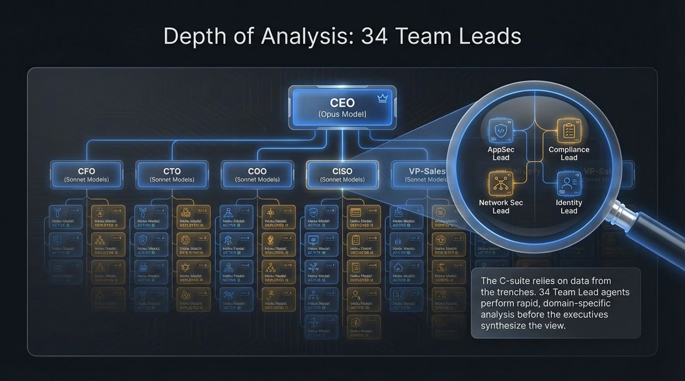

</div>

| Layer | Default Model | Agent Count | Rationale |
|-------|---------------|-------------|-----------|
| **CEO** | Opus | 1 | Cross-domain synthesis demands the highest reasoning quality. The CEO must weigh competing perspectives, identify fault lines, and produce nuanced judgment. This is the most cognitively demanding task in the cascade. |
| **C-Suite** | Sonnet | 9 | Domain decomposition and synthesis. Each C-suite agent creates a division team, spawns team leads as teammates, collects findings via SendMessage, and synthesizes a domain recommendation. Sonnet balances capability with cost. |
| **Team Leads** | Haiku | 34 | Narrow specialist analysis. Each team lead has a unique analytical framework and a focused lens. Team leads SendMessage findings back to their C-suite parent. Cost-efficient for high parallelism. Model diversity across the hierarchy improves system robustness. |

Model assignments are configurable -- see [10.3 API & Agent Configuration](#103-api--agent-configuration) for tier defaults and per-agent overrides.

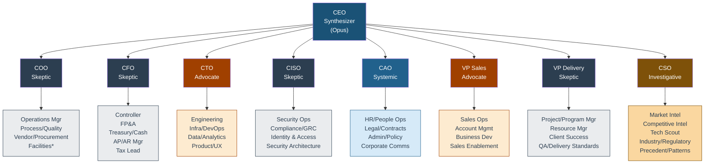
```mermaid
flowchart TD
    CEO["CEO\nSynthesizer\n(Opus)"]

    COO["COO\nSkeptic"]
    CFO["CFO\nSkeptic"]
    CTO["CTO\nAdvocate"]
    CISO["CISO\nSkeptic"]
    CAO["CAO\nSystemic"]
    VPS["VP Sales\nAdvocate"]
    VPD["VP Delivery\nSkeptic"]
    CSO["CSO\nInvestigative"]

    CEO --> COO & CFO & CTO & CISO
    CEO --> CAO & VPS & VPD & CSO

    COO --> COO_TL["Operations Mgr\nProcess/Quality\nVendor/Procurement\nFacilities*"]
    CFO --> CFO_TL["Controller\nFP&A\nTreasury/Cash\nAP/AR Mgr\nTax Lead"]
    CTO --> CTO_TL["Engineering\nInfra/DevOps\nData/Analytics\nProduct/UX"]
    CISO --> CISO_TL["Security Ops\nCompliance/GRC\nIdentity & Access\nSecurity Architecture"]
    CAO --> CAO_TL["HR/People Ops\nLegal/Contracts\nAdmin/Policy\nCorporate Comms"]
    VPS --> VPS_TL["Sales Ops\nAccount Mgmt\nBusiness Dev\nSales Enablement"]
    VPD --> VPD_TL["Project/Program Mgr\nResource Mgr\nClient Success\nQA/Delivery Standards"]
    CSO --> CSO_TL["Market Intel\nCompetitive Intel\nTech Scout\nIndustry/Regulatory\nPrecedent/Patterns"]

    style CEO fill:#1A5276,color:#fff
    style COO fill:#2C3E50,color:#fff
    style CFO fill:#2C3E50,color:#fff
    style CISO fill:#2C3E50,color:#fff
    style VPD fill:#2C3E50,color:#fff
    style CTO fill:#A04000,color:#fff
    style VPS fill:#A04000,color:#fff
    style CAO fill:#21618C,color:#fff
    style CSO fill:#7E5109,color:#fff

    style COO_TL fill:#EAECEE,stroke:#2C3E50,color:#2C3E50
    style CFO_TL fill:#EAECEE,stroke:#2C3E50,color:#2C3E50
    style CISO_TL fill:#EAECEE,stroke:#2C3E50,color:#2C3E50
    style VPD_TL fill:#EAECEE,stroke:#2C3E50,color:#2C3E50
    style CTO_TL fill:#FDEBD0,stroke:#A04000,color:#2C3E50
    style VPS_TL fill:#FDEBD0,stroke:#A04000,color:#2C3E50
    style CAO_TL fill:#D6EAF8,stroke:#21618C,color:#2C3E50
    style CSO_TL fill:#FAD7A0,stroke:#7E5109,color:#2C3E50
```

<sub>*Facilities/Office Manager conditionally active based on company archetype.</sub>

### 8.2 Operational Isolation

CDP enforces strict operational isolation between agents. This isn't an implementation detail -- it's a design principle that ensures the quality of the analysis.

<div align="center">

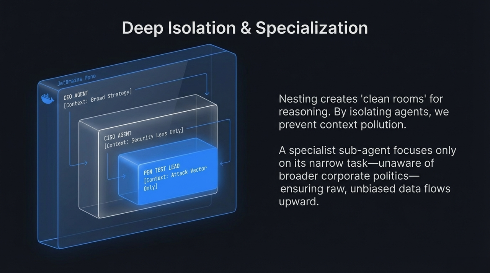

</div>

**Clean-room isolation:** Each agent reasons independently within its domain. A team lead doesn't see what other team leads are producing. A C-suite agent doesn't see what other C-suite agents are recommending until the pre-mortem phase (Tier 3 only). This prevents groupthink and ensures each perspective is genuinely independent.

**Two-tier visibility:** Team lead findings flow through their C-suite parent, not directly to the CEO. The C-suite agent synthesizes raw findings into a domain recommendation before it reaches the CEO. This prevents the CEO from cherry-picking individual team lead findings that support a preferred conclusion -- the CEO works with domain-level synthesis, not raw data.

**Unbiased reasoning:** Because agents don't see each other's work during the analytical phases, there's no anchoring effect. The CFO's analysis doesn't shift because they saw the CTO's optimistic assessment first. Each domain produces its honest perspective, and disagreement is preserved at full strength for the CEO to weigh.

The one exception is Phase 4.5 (Pre-Mortem Challenge, Tier 3 only), where all C-suite agents receive summaries of all peer recommendations and are asked: "Assume this decision fails catastrophically in 12 months. What caused the failure?" This is a controlled break in isolation -- and it happens only after each agent has already committed to their own position.

### 8.3 C-Suite Roster

| Role | Disposition | Mandate |
|------|-------------|---------|
| **CEO** | Synthesizer | Frame, listen, weigh, decide. Value is judgment. |
| **COO** | Skeptic | "Can we actually do this with the people and processes we have?" |
| **CFO** | Skeptic | "Find the costs that aren't in the proposal." |
| **CTO** | Advocate | "What does this make possible that wasn't possible before?" |
| **CISO** | Skeptic | "Change introduces risk. You are the organization's immune system." |
| **CAO** | Systemic | "Can the organization -- people, policies, culture -- absorb this?" |
| **VP Sales** | Advocate | "How does this help us sell more, faster, or to new markets?" |
| **VP Delivery** | Skeptic | "What do we sacrifice from existing commitments to do this?" |
| **CSO** | Investigative | "What does the evidence say? Bring facts where others bring assumptions." |

**Disposition balance:** 4 Skeptics + 2 Advocates + 1 Systemic + 1 Investigative + 1 Synthesizer. Skeptic-heavy to counterbalance human and LLM optimism bias.

### 8.4 Team Lead Roster

Each team lead has a unique analytical framework, mandatory output template, three forcing questions (Pre-Mortem, Adversarial Empathy, Domain Devil's Advocate), and restricted tool access (Read, Grep, Glob, WebSearch only).

| C-Suite Parent | Team Leads | Count |
|----------------|------------|-------|
| **COO** | Operations Mgr, Process/Quality Lead, Vendor/Procurement Mgr, Facilities/Office Mgr* | 4 |
| **CFO** | Controller, Head of FP&A, Treasury/Cash Mgr, AP/AR Mgr, Tax Lead | 5 |
| **CTO** | Engineering Lead, Infrastructure/DevOps Lead, Data/Analytics Lead, Product/UX Lead | 4 |
| **CISO** | Security Ops Lead, Compliance/GRC Lead, Identity & Access Lead, Security Architecture Lead | 4 |
| **VP Sales** | Sales Ops Lead, Account Mgmt Lead, Business Dev Lead, Sales Enablement Lead | 4 |
| **VP Delivery** | Project/Program Mgr, Resource Mgr, Client Success Lead, QA/Delivery Standards Lead | 4 |
| **CAO** | HR/People Ops Lead, Legal/Contracts Lead, Admin/Policy Lead, Corporate Comms Lead | 4 |
| **CSO** | Market Intel Lead, Competitive Intel Lead, Technology Scout Lead, Industry/Regulatory Analyst, Precedent/Patterns Analyst | 5 |
| **Total** | | **34** |

<sub>*Facilities/Office Manager conditionally active based on company archetype.</sub>

> **Note:** 14 of 34 team leads have a fourth forcing question -- the **Cross-Domain Challenge** -- targeting high-interaction pairs where cross-domain assumptions create blind spots. For example, the Engineering Lead is asked to consider implications for Security Architecture, and the Sales Ops Lead is asked to consider implications for Client Success. These cross-domain challenges surface assumptions that might otherwise go unexamined.

---

## Chapter 9 -- The Five-Phase Cascade

The five-phase cascade is the core execution model for Tier 3 (Board Meeting) deliberations. Each phase feeds the next in a structured information flow that moves from broad context to narrow analysis to synthesized judgment. Understanding this cascade is essential for interpreting Decision Records and knowing what happens at each stage of a full deliberation.

<div align="center">

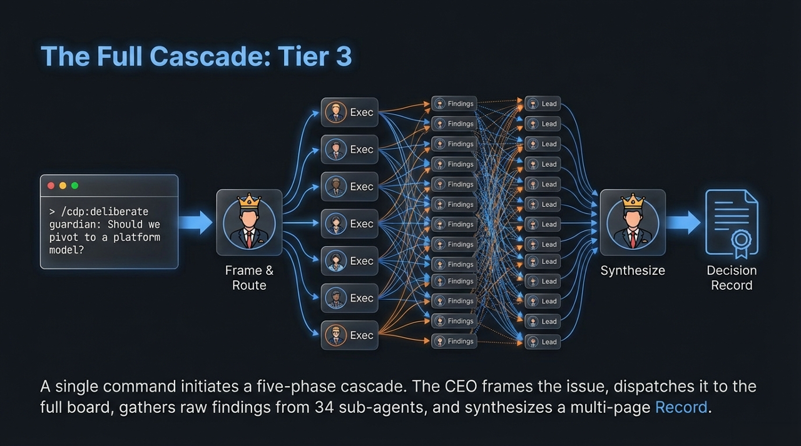

</div>

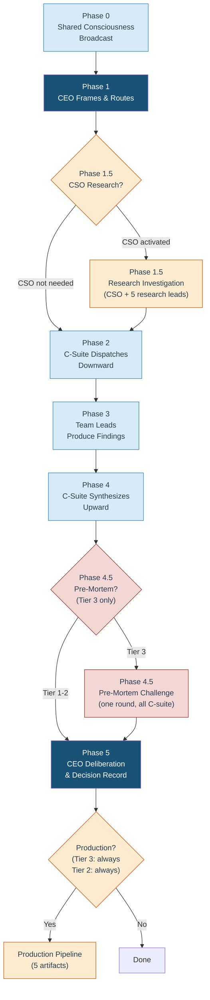
```mermaid
flowchart TD
    P0["Phase 0\nShared Consciousness\nBroadcast"]
    P1["Phase 1\nCEO Frames & Routes"]
    P15{"Phase 1.5\nCSO Research?"}
    P15Y["Phase 1.5\nResearch Investigation\n(CSO + 5 research leads)"]
    P2["Phase 2\nC-Suite Dispatches\nDownward"]
    P3["Phase 3\nTeam Leads\nProduce Findings"]
    P4["Phase 4\nC-Suite Synthesizes\nUpward"]
    P45{"Phase 4.5\nPre-Mortem?\n(Tier 3 only)"}
    P45Y["Phase 4.5\nPre-Mortem Challenge\n(one round, all C-suite)"]
    P5["Phase 5\nCEO Deliberation\n& Decision Record"]
    PROD{"Production?\n(Tier 3: always\nTier 2: always)"}
    PRODY["Production Pipeline\n(5 artifacts)"]

    P0 --> P1
    P1 --> P15
    P15 -->|CSO activated| P15Y
    P15 -->|CSO not needed| P2
    P15Y --> P2
    P2 --> P3
    P3 --> P4
    P4 --> P45
    P45 -->|Tier 3| P45Y
    P45 -->|Tier 1-2| P5
    P45Y --> P5
    P5 --> PROD
    PROD -->|Yes| PRODY
    PROD -->|No| END["Done"]

    style P0 fill:#D6EAF8,stroke:#2980B9,color:#2C3E50
    style P1 fill:#1A5276,color:#fff
    style P15 fill:#FDEBD0,stroke:#D35400,color:#2C3E50
    style P15Y fill:#FDEBD0,stroke:#D35400,color:#2C3E50
    style P2 fill:#D6EAF8,stroke:#2980B9,color:#2C3E50
    style P3 fill:#D6EAF8,stroke:#2980B9,color:#2C3E50
    style P4 fill:#D6EAF8,stroke:#2980B9,color:#2C3E50
    style P45 fill:#F2D7D5,stroke:#922B21,color:#2C3E50
    style P45Y fill:#F2D7D5,stroke:#922B21,color:#2C3E50
    style P5 fill:#1A5276,color:#fff
    style PROD fill:#FDEBD0,stroke:#D35400,color:#2C3E50
    style PRODY fill:#FDEBD0,stroke:#D35400,color:#2C3E50
```

### Phase 0 -- Shared Consciousness Broadcast

**Who's involved:** CEO (broadcasting) → All activated C-suite agents (receiving)

**What's produced:** A shared context package containing the user's issue, company data (from `.cdp-context/company.md` if available), routing rationale, and the active decision mode. The broadcast includes everything an agent needs to reason independently: the problem statement, the company's financial position, headcount, tech stack, strategic constraints, and any CSO research findings from Phase 1.5.

**How it feeds the next phase:** Every activated agent starts with the same picture. This is the foundation for independent reasoning -- agents don't need to guess at context because they all received it simultaneously. The shared consciousness broadcast is what makes CDP's operational isolation work: agents can reason independently without needing to communicate because they all started with the same comprehensive context.

**Why it matters:** Without Phase 0, each agent would need to request context individually, leading to inconsistent information across domains. The broadcast ensures that when the CFO says "given our $2M runway" and the CTO says "given our $2M runway," they're working from the same number -- not different assumptions about the company's financial position.

<div align="center">

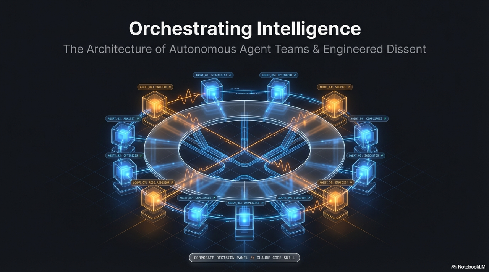

</div>

### Phase 1 -- CEO Frames and Routes

**Who's involved:** CEO (solo)

**What's produced:** Issue decomposition into evaluation dimensions, decision type classification, routing selection via the routing table, full-activation threshold evaluation, activation and exclusion reasoning, and CSO research directive (if applicable).

**How it feeds the next phase:** The CEO's framing defines what each C-suite agent will analyze. The routing decision determines who is activated and who is excluded. The activation reasoning is transparent and auditable -- the CEO states who is in, who is out, and why.

> **Example:** For "Should we acquire CompetitorX?", the CEO might classify this as a Strategic decision, note that it triggers the irreversibility full-activation threshold (acquisitions are practically irreversible), activate all C-suite members, and direct the CSO to research CompetitorX's market position, financial health, and regulatory exposure.

### Phase 1.5 -- Research Investigation (Conditional)

**Who's involved:** CSO + 5 research team leads (Market Intelligence, Competitive Intelligence, Technology Scout, Industry & Regulatory Analyst, Precedent & Patterns Analyst)

**What's produced:** Research Dossier with evidence quality grade and Assumption Registry. The five research leads work in parallel on different facets of the research directive. Each lead uses web search to gather real-world evidence -- market data, competitor information, regulatory landscapes, and historical precedents.

**How it feeds the next phase:** The Research Dossier is broadcast to all activated C-suite agents before they begin their domain analysis. This ensures domain analysis is grounded in evidence rather than assumptions. The Assumption Registry explicitly tracks which claims are evidence-backed and which remain assumptions, preventing false confidence.

**When it executes:** Only when the CEO activates the CSO in Phase 1. Typically activated for Strategic and Compliance/Risk decisions; rarely for Operational or Personnel decisions.

### Phase 2 -- C-Suite Dispatches Downward

**Who's involved:** All activated C-suite agents (each creating a division team) → Their team leads (spawned as teammates)

**What's produced:** Domain-specific sub-questions for each team lead. This is analytical translation, not forwarding -- the CFO doesn't pass the CEO's question to the Controller; the CFO asks the Controller "what are the GAAP implications?" The VP Delivery doesn't forward the issue to the Resource Manager; the VP Delivery asks "what existing commitments would be impacted if we redirected 30% of engineering capacity?" Each C-suite agent creates a division team (TeamCreate) and spawns team leads as teammates (Agent with team_name), each running in a separate tmux window for true parallel execution.

**How it feeds the next phase:** Each team lead receives a focused, domain-specific question that they can analyze through their narrow specialist lens. The quality of this translation directly affects the quality of team lead findings -- a well-framed sub-question produces sharper analysis than a generic forwarding.

### Phase 3 -- Team Leads Produce Findings

**Who's involved:** All activated team leads (34 maximum, working in parallel within each domain)

**What's produced:** Narrow, focused analysis through each team lead's specialist lens, using their unique analytical framework and mandatory output template. Different methods produce structurally different outputs -- the Controller's financial analysis looks nothing like the Security Ops Lead's threat assessment.

Each team lead also answers three forcing questions: a **Pre-Mortem** question ("What would make this fail?"), an **Adversarial Empathy** question ("What would someone who disagrees with me say?"), and a **Domain Devil's Advocate** question (challenging their own domain's conventional wisdom). These forcing questions prevent comfortable conclusions.

**How it feeds the next phase:** Findings flow upward to the parent C-suite agent via SendMessage. Team leads do not communicate with other team leads or with the CEO directly. This isolation is intentional -- it preserves independent analysis.

### Phase 4 -- C-Suite Synthesizes Upward

**Who's involved:** All activated C-suite agents

**What's produced:** Domain recommendation with confidence level, key risks, key opportunities, and flagged internal contradictions. If team leads within a domain disagree, the C-suite agent flags this as an analytical signal rather than averaging it away.

**How it feeds the next phase:** Domain recommendations are collected by the CEO for final synthesis. In Tier 3, they also feed Phase 4.5 (Pre-Mortem). The confidence level is critical -- a high-confidence recommendation from the CISO carries different weight than a low-confidence speculation from the VP Sales, and the CEO's synthesis mode determines how those confidence differentials affect the final decision.

### Phase 4.5 -- Pre-Mortem Challenge (Tier 3 Only)

**Who's involved:** All activated C-suite agents

**What's produced:** Each agent receives summaries of ALL other C-suite recommendations and answers: "Assume this decision fails catastrophically in 12 months. What caused the failure?" One round only -- no back-and-forth.

**How it feeds the next phase:** Pre-mortem responses give the CEO a final layer of adversarial analysis. This is the only point where C-suite agents see each other's work, and they see it only after they've already committed to their own positions.

### Phase 5 -- CEO Deliberation

**Who's involved:** CEO (solo)

**What's produced:** The CEO maps all domain recommendations onto a decision matrix, identifies fault lines (where perspectives collide), determines the most determinative perspective, applies the active decision mode, and produces the Decision Record.

The CEO's deliberation follows a structured process:
1. **Map domain recommendations** onto the evaluation dimensions from Phase 1
2. **Identify fault lines** -- where do domains disagree, and what drives the disagreement?
3. **Determine the most determinative perspective** -- which domain's recommendation, if wrong, would have the biggest consequences?
4. **Apply the decision mode** -- Guardian weighs skeptics, Pioneer weighs advocates, Analyst weighs confidence, etc.
5. **Produce the decision** with conditions, guardrails, dissenting views, and next steps

**How it feeds production:** The Decision Record is the source document for the production pipeline. After Phase 5, production agents generate the HTML briefing, PPTX presentation, DOCX report, and PDF artifacts.

### Phase Comparison by Tier

Not every phase executes at every tier. The lighter tiers skip phases that aren't needed for their level of analysis. Here's what runs at each tier and what's skipped:

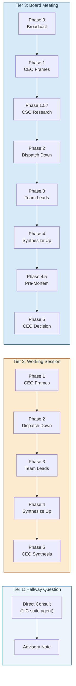
```mermaid
flowchart LR
    subgraph T1["Tier 1: Hallway Question"]
        T1A["Direct Consult\n(1 C-suite agent)"]
        T1B["Advisory Note"]
        T1A --> T1B
    end

    subgraph T2["Tier 2: Working Session"]
        T2P1["Phase 1\nCEO Frames"]
        T2P2["Phase 2\nDispatch Down"]
        T2P3["Phase 3\nTeam Leads"]
        T2P4["Phase 4\nSynthesize Up"]
        T2P5["Phase 5\nCEO Synthesis"]
        T2P1 --> T2P2 --> T2P3 --> T2P4 --> T2P5
    end

    subgraph T3["Tier 3: Board Meeting"]
        T3P0["Phase 0\nBroadcast"]
        T3P1["Phase 1\nCEO Frames"]
        T3P15["Phase 1.5?\nCSO Research"]
        T3P2["Phase 2\nDispatch Down"]
        T3P3["Phase 3\nTeam Leads"]
        T3P4["Phase 4\nSynthesize Up"]
        T3P45["Phase 4.5\nPre-Mortem"]
        T3P5["Phase 5\nCEO Decision"]
        T3P0 --> T3P1 --> T3P15 --> T3P2 --> T3P3 --> T3P4 --> T3P45 --> T3P5
    end

    style T1 fill:#EBF5FB,stroke:#2980B9,color:#2C3E50
    style T2 fill:#FDEBD0,stroke:#D35400,color:#2C3E50
    style T3 fill:#D6EAF8,stroke:#1A5276,color:#2C3E50
```

---

<div align="center">

## Part V

# Configuration

</div>

---

## Chapter 10 -- Configuration

CDP is configurable at three levels: **Company Profile** (archetype presets and overrides), **Company Context** (real company data for grounded reasoning), and **Routing Table** (decision type routing and activation thresholds). These three levels work together to customize CDP for your organization:

- **Company Profile** defines _who_ analyzes (which agents are active, what mode is default)
- **Company Context** defines _what they know_ (your actual numbers, constraints, and strategic position)
- **Routing Table** defines _who gets called when_ (which domains are activated for each decision type)

### 10.1 Company Profile

Archetype presets define roster modifications, default mode, compliance focus, and escalation behavior for different industry types. Select an archetype during setup, then override individual settings as needed.

#### Technology / SaaS (Default)

Default for mid-market IT/technology services companies, 200-500 employees.

| Setting | Value |
|---------|-------|
| **Roster Modifications** | Facilities/Office Manager inactive. Product/UX Lead active under CTO. |
| **Default Mode** | Analyst |
| **Compliance Focus** | SOC 2, GDPR |
| **Escalation Bias** | Normal |
| **Notes** | Pioneer-leaning for growth-stage companies. Technical decisions route through CTO + CISO by default. |

#### Professional Services

For consulting, legal, accounting, and other professional services firms.

| Setting | Value |
|---------|-------|
| **Roster Modifications** | All roles active. VP Delivery weighted heavily in routing. |
| **Default Mode** | Architect |
| **Compliance Focus** | Client contract compliance, professional liability |
| **Escalation Bias** | Normal |
| **Notes** | Client-centric framing in COO and VP Sales domains. Resource Manager and Client Success Lead are primary analytical voices. |

#### Regulated Industry

For healthcare, financial services, energy, and other regulated sectors.

| Setting | Value |
|---------|-------|
| **Roster Modifications** | All roles active. Compliance/GRC Lead has expanded scope. |
| **Default Mode** | Guardian |
| **Compliance Focus** | HIPAA, SOX, PCI-DSS (industry-specific, configured at setup) |
| **Escalation Bias** | Conservative |
| **Notes** | Industry-specific compliance frameworks auto-configured. CISO and CAO Legal are always activated for decisions touching regulated areas. |

#### Manufacturing / Physical

For manufacturing, logistics, and physical product companies.

| Setting | Value |
|---------|-------|
| **Roster Modifications** | Facilities/Office Manager active. Supply chain emphasis in COO domain. |
| **Default Mode** | Analyst |
| **Compliance Focus** | Industry safety standards, environmental regulations |
| **Escalation Bias** | Normal |
| **Notes** | Vendor/Procurement Manager weighted heavily. COO domain is the default primary perspective for operational decisions. |

#### Archetype Comparison

| Archetype | Default Mode | Compliance Focus | Escalation Bias | Key Roster Changes |
|-----------|-------------|------------------|-----------------|-------------------|
| **Technology / SaaS** (default) | Analyst | SOC 2, GDPR | Normal | Facilities inactive, Product/UX active |
| **Professional Services** | Architect | Client contracts, professional liability | Normal | All active, VP Delivery weighted heavily |
| **Regulated Industry** | Guardian | HIPAA, SOX, PCI-DSS (auto-configured) | Conservative | Compliance/GRC expanded, CISO + CAO Legal always active |
| **Manufacturing / Physical** | Analyst | Safety standards, environmental | Normal | Facilities active, Vendor/Procurement weighted |

#### Override Mechanism

After selecting an archetype, override individual settings:

```yaml
archetype: technology-saas        # Base preset

overrides:
  roster:
    facilities-office-manager: active
  default_mode: guardian
  escalation_bias: conservative
  compliance_frameworks:
    - SOC 2
    - HIPAA
```

Available overrides:

```yaml
overrides:
  team_leads:
    # Deactivate a role
    facilities-office-manager: { active: false }
    # Activate a conditional role
    facilities-office-manager: { active: true }
    # Reassign reporting
    product-ux-lead: { reports_to: coo }

  # Change default synthesis mode
  default_mode: guardian

  # Adjust escalation sensitivity
  # conservative = more likely to escalate to higher tiers
  # aggressive = less likely to escalate, keeps analysis lean
  escalation_bias: conservative

  # Add industry-specific compliance frameworks
  compliance_frameworks:
    - SOC2
    - GDPR
    - HIPAA
```

#### Calibration Protocol

When the skill is first configured for a company, run an organizational stress test to verify the modes produce meaningfully different outcomes:

1. **Select a contentious test issue** -- an issue where reasonable people would disagree. Example: *"Should we acquire a competitor that would double our headcount but carries significant regulatory risk and requires taking on substantial debt?"*

2. **Run full Tier 3 cascade** -- validates all agents produce coherent, domain-appropriate analysis for this company type.

3. **Run all five Decision Modes** -- domain analysis runs once, CEO synthesis runs five times.

4. **Verify 3-of-5 divergence** -- at least 3 of 5 modes must produce materially different outcomes. "Materially different" means either a different decision (approve vs. oppose vs. defer) or the same decision with substantially different conditions, guardrails, or accepted risks.

5. **Log calibration results:**

```yaml
calibration:
  stress_test_issue: "[issue description]"
  date: "[timestamp]"
  mode_results:
    guardian: "[decision summary]"
    pioneer: "[decision summary]"
    architect: "[decision summary]"
    analyst: "[decision summary]"
    sentinel: "[decision summary]"
  divergence_score: "[N] of 5 modes produced different decisions"
  calibration_status: pass  # or fail -- requiring prompt modifier revision
```

If calibration fails (fewer than 3 modes diverge on a deliberately contentious issue), the prompt modifiers need revision before the skill is considered calibrated.

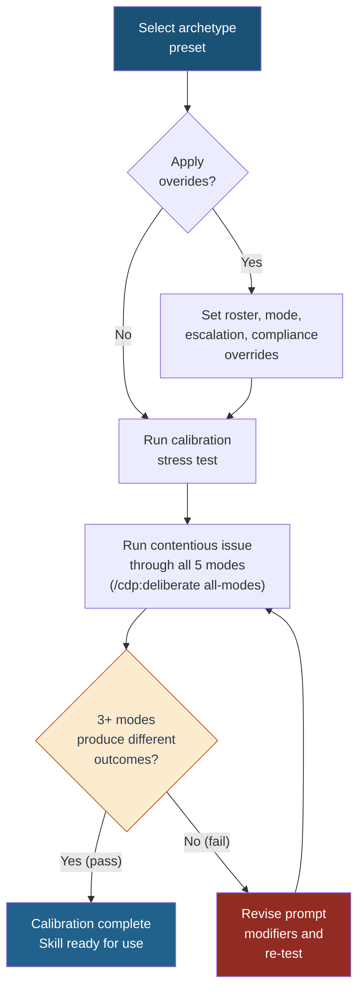
```mermaid
flowchart TD
    Start["Select archetype\npreset"] --> Override{"Apply\noverides?"}
    Override -->|Yes| Customize["Set roster, mode,\nescalation, compliance\noverrides"]
    Override -->|No| Test["Run calibration\nstress test"]
    Customize --> Test

    Test --> Run["Run contentious issue\nthrough all 5 modes\n(/cdp:deliberate all-modes)"]
    Run --> Check{"3+ modes\nproduce different\noutcomes?"}

    Check -->|"Yes (pass)"| Done["Calibration complete\nSkill ready for use"]
    Check -->|"No (fail)"| Revise["Revise prompt\nmodifiers and\nre-test"]
    Revise --> Run

    style Start fill:#1A5276,color:#fff
    style Done fill:#21618C,color:#fff
    style Revise fill:#922B21,color:#fff
    style Check fill:#FDEBD0,stroke:#D35400,color:#2C3E50
```

> **Important:** Calibration is optional but recommended. Without it, there's no guarantee that the modes produce meaningfully different outcomes for your company's specific context. A failed calibration doesn't mean the skill is broken -- it means the modes need tuning for your particular industry and company profile.

### 10.2 Company Context

An optional markdown file containing real company data -- financials, headcount, tech stack, strategic position, constraints -- that grounds agent reasoning in facts rather than generic frameworks.

**Location:** `.cdp-context/company.md` (gitignored by default)

**Create from template:**

```bash
mkdir -p .cdp-context
cp .claude/skills/corporate-decision-panel/templates/company-context.md .cdp-context/company.md
# Edit with your company's actual data
```

**Available sections:**

| Section | Contents |
|---------|----------|
| Company Overview | Name, industry, stage, headcount, locations |
| Financial Position | Revenue, burn rate, runway, margins, funding |
| Team & Organization | Org structure, key roles, capacity, culture |
| Technology | Stack, infrastructure, technical debt, roadmap |
| Operations | Processes, vendors, SLAs, pain points |
| Strategic Position | Market position, competitors, differentiators |
| Constraints & Context | Regulatory, contractual, resource, timeline constraints |

All sections are optional -- agents use whatever is provided and note confidence gaps for what's missing.

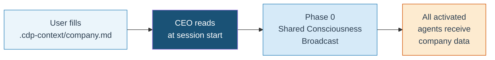
```mermaid
flowchart LR
    User["User fills\n.cdp-context/company.md"]
    CEO_Read["CEO reads\nat session start"]
    P0["Phase 0\nShared Consciousness\nBroadcast"]
    Agents["All activated\nagents receive\ncompany data"]

    User --> CEO_Read --> P0 --> Agents

    style User fill:#EBF5FB,stroke:#2980B9,color:#2C3E50
    style CEO_Read fill:#1A5276,color:#fff
    style P0 fill:#D6EAF8,stroke:#2980B9,color:#2C3E50
    style Agents fill:#FDEBD0,stroke:#D35400,color:#2C3E50
```

Without this file, agents reason using general frameworks. With it, agents ground their analysis in actual numbers and constraints. The difference is substantial -- a CFO analyzing your hiring capacity is far more useful when it knows your burn rate and runway than when it's guessing from industry averages.

**Privacy:** The `.cdp-context/` directory is gitignored by default. It contains sensitive business data and should never be committed to version control.

### 10.3 API & Agent Configuration

A markdown file that configures the Gemini API for infographic generation and agent model assignments.

**Location:** `.cdp-context/config.md` (gitignored by default)

**Create from template:**

```bash
mkdir -p .cdp-context
cp .claude/skills/corporate-decision-panel/templates/config-context.md .cdp-context/config.md
# Edit with your API key and preferred model
```

**Available settings:** Gemini API key (required), image model selection,
retry limit, agent model tier defaults, and per-agent model overrides.
See `templates/config-context.md` for all fields.

#### Agent Model Configuration

The Agent Models section lets you override default model assignments. Set tier-wide defaults under `### Tier Defaults` and per-agent overrides under `### Per-Agent Overrides`:

```markdown
## Agent Models

### Tier Defaults
- **CEO:** opus
- **C-Suite:** sonnet
- **Team Leads:** haiku

### Per-Agent Overrides
- **cfo:** opus
- **vp-sales:** haiku
```

Resolution order: per-agent override > tier default > built-in default. The orchestration protocol runs `scripts/apply_models.py` at session start to apply these settings to `.claude/agents/` frontmatter. Valid models: `opus`, `sonnet`, `haiku`.

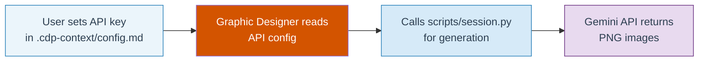
```mermaid
flowchart LR
    User["User sets API key\nin .cdp-context/config.md"]
    IA["Graphic Designer reads\nAPI config"]
    Script["Calls scripts/session.py\nfor generation"]
    API["Gemini API returns\nPNG images"]

    User --> IA --> Script --> API

    style User fill:#EBF5FB,stroke:#2980B9,color:#2C3E50
    style IA fill:#D35400,color:#fff
    style Script fill:#D6EAF8,stroke:#2980B9,color:#2C3E50
    style API fill:#E8DAEF,stroke:#6C3483,color:#2C3E50
```

Without this file, the generation script cannot run -- a valid Gemini API key is required.

**Privacy:** The `.cdp-context/` directory is gitignored by default. It contains sensitive business data and should never be committed to version control.

### 10.4 Routing Table

The routing table determines which C-suite agents are activated for each decision type. The CEO selects routing during Phase 1 based on the decision type classification and can always override defaults.

#### Default Activation by Decision Type

| Decision Type | Default Activation | Description |
|--------------|-------------------|-------------|
| **Strategic** | CEO, CFO, CTO, VP Sales | Acquisition, market strategy, competitive positioning, business model changes |
| **Operational** | CEO, COO, VP Delivery | Major process change, workflow restructuring, org restructure |
| **Financial** | CEO, CFO, COO | Funding round, major investment, cost reduction, budget reallocation |
| **Technical** | CEO, CTO, CISO | Platform migration, architecture change, technology adoption, infrastructure |
| **Personnel** | CEO, CAO, COO, VP Delivery | Layoff, major hiring, reorganization, culture change |
| **Compliance/Risk** | CEO, CISO, CAO, CFO | Regulatory change, breach response, audit, legal exposure |

#### Full-Activation Threshold Conditions

After classifying the decision type and selecting default routing, the CEO assesses whether the issue has cross-cutting implications. If **any** of the following conditions apply, **all** C-suite members activate regardless of decision type:

| # | Threshold | Examples | Rationale |
|---|-----------|----------|-----------|
| 1 | **Irreversibility** | Acquisition, divestiture, platform decommission | Irreversible decisions need every perspective because there's no course correction |
| 2 | **Headcount Impact >30%** | Layoff, rapid scaling, major reorg | Large headcount changes touch every domain: finance, operations, delivery, HR, morale |
| 3 | **Market Position Change** | Pivot, new market entry, pricing model change | Business model changes affect every function differently |
| 4 | **Existential Financial Risk** | Bet-the-company investment, funding dependency | Existential risks demand the fullest possible analysis |
| 5 | **Domain Uncertainty** | Novel situation, unprecedented decision | When the CEO doesn't know which domains are relevant, activate all of them |

The CEO states activation reasoning in the CEO Framing section of the Decision Record, including which threshold conditions (if any) triggered full activation. This makes routing a transparent, auditable analytical act -- the user can always see why the full board was convened (or why it wasn't).

#### CSO Research Activation Patterns

| Decision Type | CSO Activation | Rationale |
|--------------|---------------|-----------|
| Strategic | Usually | Market data, competitor analysis, precedent research needed |
| Compliance/Risk | Usually | Regulatory landscape, legal precedent research needed |
| Financial | Sometimes | Market conditions, precedent transactions may be relevant |
| Technical | Sometimes | Technology landscape, vendor comparisons may be relevant |
| Operational | Rarely | Internal processes rarely require external evidence |
| Personnel | Rarely | Internal HR decisions rarely require external research |

When the CSO is activated, Phase 1.5 (Research Investigation) executes before domain analysis begins. The CSO's Research Dossier is broadcast to all activated C-suite members, ensuring domain analysis is grounded in evidence.

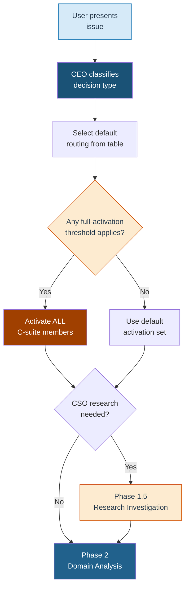
```mermaid
flowchart TD
    Issue["User presents\nissue"] --> Classify["CEO classifies\ndecision type"]
    Classify --> Route["Select default\nrouting from table"]
    Route --> Threshold{"Any full-activation\nthreshold applies?"}

    Threshold -->|Yes| Full["Activate ALL\nC-suite members"]
    Threshold -->|No| Default["Use default\nactivation set"]

    Full --> CSO{"CSO research\nneeded?"}
    Default --> CSO

    CSO -->|Yes| Research["Phase 1.5\nResearch Investigation"]
    CSO -->|No| Analysis["Phase 2\nDomain Analysis"]
    Research --> Analysis

    style Issue fill:#D6EAF8,stroke:#2980B9,color:#2C3E50
    style Classify fill:#1A5276,color:#fff
    style Threshold fill:#FDEBD0,stroke:#D35400,color:#2C3E50
    style Full fill:#A04000,color:#fff
    style Research fill:#FDEBD0,stroke:#D35400,color:#2C3E50
    style Analysis fill:#21618C,color:#fff
```

---

<div align="center">

## Part VI

# Output & Production

</div>

---

## Chapter 11 -- Output Formats

CDP produces four output formats, one for each engagement pattern:

| Tier | Output Format | Length | When Produced |
|------|--------------|--------|---------------|
| Tier 1 | Advisory Note | 3-5 sentences | Every `/cdp:consult` |
| Tier 2 | Panel Assessment | ~1 page | Every `/cdp:panel` |
| Tier 3 | Decision Record | 3-5 pages | Every `/cdp:deliberate` |
| Multi-mode | Comparative Decision Record | Extended | Any multi-mode invocation |

### Advisory Note (Tier 1)

Direct, opinionated, domain-specific response from a single C-suite agent. The Advisory Note is the lightest CDP output -- designed for quick gut-checks where you want one expert perspective, not a committee.

The Advisory Note includes:

- The agent's recommendation with confidence level (High / Medium / Low)
- Key reasoning in 3-5 sentences, drawing from the agent's domain expertise
- An **Escalation Brief** (if cross-domain implications are detected) suggesting which additional domains should weigh in and why

The Escalation Brief is a key safety mechanism. Even at Tier 1, the agent is aware of its domain boundaries. If the CFO detects that a hiring question has technology implications (e.g., "the tooling budget for 15 engineers would exceed our infrastructure allocation"), the Escalation Brief flags this and suggests involving the CTO. This prevents Tier 1 from producing confident single-domain answers to multi-domain questions.

The Advisory Note is deliberately concise. If you need more, escalate to Tier 2.

### Panel Assessment (Tier 2)

Structured multi-perspective analysis from a focused panel. The Panel Assessment balances thoroughness with practicality -- detailed enough to surface genuine disagreements, concise enough for daily use.

The Panel Assessment includes:

- Issue summary as framed by the CEO
- Activated domains and routing rationale
- Per-domain recommendations with confidence levels
- Key agreements across domains (where all activated domains align)
- Key disagreements (fault lines -- where domains diverge and why)
- CEO synthesis applying the active decision mode
- Recommended next steps with concrete actions

The Panel Assessment is lightweight enough for daily use -- about one page. It's the sweet spot for most multi-domain business decisions: enough structure to surface genuine disagreements, enough brevity to fit into a working session.

### Decision Record (Tier 3)

Comprehensive deliberation output from the full cascade. The Decision Record is the definitive output of a Tier 3 deliberation and the source document for all production artifacts. It contains nine sections:

1. **Executive Summary** -- One-paragraph decision with key conditions. Written to be self-contained: a reader who reads only this paragraph should understand the decision, its most important condition, and its primary risk.

2. **Issue Statement** -- The user's original issue as framed by the CEO. Includes the CEO's decomposition into evaluation dimensions and the decision type classification.

3. **CEO Framing** -- Decision type classification, routing rationale (who was activated and why, who was excluded and why), evaluation dimensions, and any full-activation thresholds that were triggered. This section makes the routing transparent and auditable.

4. **Domain Analyses** -- Per-domain recommendations with team lead findings, confidence levels, risks, and opportunities. Each domain section includes the C-suite agent's synthesis and the key findings from their team leads. Internal contradictions within a domain are flagged as analytical signals.

5. **Fault Line Analysis** -- Where perspectives collide, why they collide, and which fault line is most determinative. This is often the most valuable section -- it reveals the genuine tradeoffs that no single-domain analysis would surface.

6. **CEO Decision** -- The synthesized decision applying the active decision mode, with conditions and guardrails. The CEO identifies which perspective was most determinative and explains why, given the active mode.

7. **Dissenting Views** -- Perspectives that disagree with the decision, preserved at full strength. The Decision Record does not soften or marginalize dissent -- if the CISO says the risk is unacceptable, that view appears here with its full reasoning, even if the CEO's decision overrules it.

8. **Next Steps** -- Concrete action items with owners and timelines. These are derived from the decision's conditions and guardrails, not generic recommendations.

9. **Metadata** -- Decision mode, routing, agents activated, phases executed, pre-mortem findings, confidence levels, and decision timestamp.

The Decision Record is 3-5 pages and is the source document for all production artifacts (HTML, PPTX, DOCX, PDFs).

### Comparative Decision Record (Multi-Mode)

When multiple modes are invoked (e.g., `guardian vs pioneer` or `all-modes`), the output extends to include:

- **Shared domain analysis** -- The analysis sections that are identical across modes. This demonstrates that the evidence base is the same -- only the synthesis philosophy changes.
- **Per-mode CEO synthesis** -- Each mode's decision, conditions, and reasoning. Each synthesis reads as a complete decision, not a summary.
- **Divergence analysis** -- Where modes agree and where they diverge, with explanation of why. Agreement points are strong signals (the evidence is decisive regardless of risk appetite). Divergence points reveal where the user's values, not the evidence, must determine the outcome.
- **Mode Sensitivity rating** -- A novel signal unique to multi-mode comparison:
  - **Low sensitivity** (modes converge): The evidence speaks for itself. The decision is the same whether you're risk-averse or growth-oriented. High confidence in the recommendation.
  - **High sensitivity** (modes diverge): The analysis doesn't determine the answer -- your personal risk appetite does. The system has done its job by showing you that reasonable people with different risk tolerances would decide differently, and now it's your call.

> **Tip:** Mode Sensitivity is often the single most valuable output of a multi-mode comparison. If you run `all-modes` and get low sensitivity, you can proceed with confidence. If you get high sensitivity, you know the decision is genuinely a judgment call -- and you know exactly which tradeoff your judgment needs to resolve.

---

## Chapter 12 -- Production Pipeline

The production pipeline transforms the deliberation output into professional, distributable artifacts. These artifacts are designed for different audiences and contexts: the HTML briefing for interactive exploration, the PPTX for board presentations, the DOCX for editing and annotation, and the PDFs for archival and printing.

<div align="center">

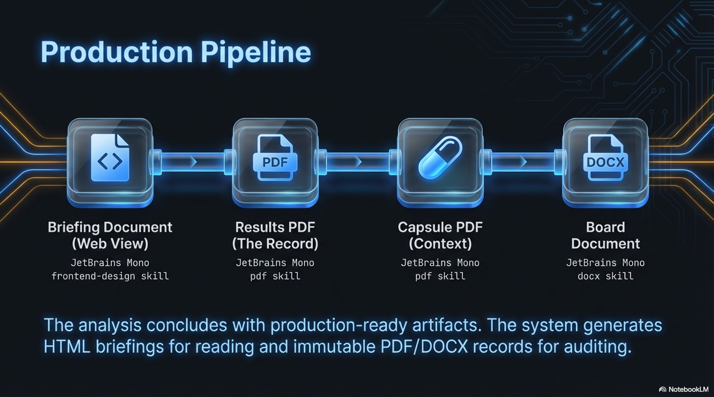

</div>

### Trigger Logic

| Tier | Production | Notes |
|------|-----------|-------|
| Tier 1 | Advisory Document (DOCX) | Produces a formal Advisory Document from the Advisory Note |
| Tier 2 | Full pipeline | HTML, PPTX, DOCX, Results PDF, Capsule PDF |
| Tier 3 | Full pipeline | HTML, PPTX, DOCX, Results PDF, Capsule PDF (automatic) |

### Session Output Directory

All production artifacts are written to a per-session directory:

```
.cdp-output/YYYY-MM-DD_<issue-slug>/
├── RECORD.md                                        # Persisted session record
├── index.html                                    # Interactive decision briefing
├── PRESENTATION_<issue-slug>.pptx                # Board-ready slide deck
├── REPORT_<issue-slug>.docx                      # Editable document
├── RESULTS_<issue-slug>.pdf                      # Native PDF from RECORD.md
├── CAPSULE_<issue-slug>.pdf                      # Layered archival record
├── images/                                       # Analytical infographics
│   ├── INFOGRAPHIC_routing-diagram.png
│   ├── INFOGRAPHIC_domain-scorecard.png
│   ├── INFOGRAPHIC_fault-lines.png
│   ├── INFOGRAPHIC_risk-matrix.png
│   ├── INFOGRAPHIC_action-plan.png
│   └── INFOGRAPHIC_mode-comparison.png           # Multi-mode only
└── build/                                        # Rerunnable build scripts
    ├── build_presentation.js
    ├── build_report.js
    └── build_capsule.py
```

The issue slug is derived from the Issue Title: lowercase, replace non-alphanumeric characters with hyphens, collapse consecutive hyphens, trim to 50 characters, strip leading/trailing hyphens.

### Artifact Pipeline

The CCO manages the production pipeline in four sequential waves -- the Graphic Designer produces infographics, then the Writer produces documents (with PNGs now available), then the Editor reviews, then the Publisher produces final artifacts:

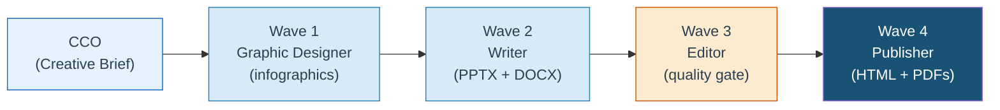
```mermaid
flowchart LR
    CCO["CCO\n(Creative Brief)"]
    GD["Wave 1\nGraphic Designer\n(infographics)"]
    W["Wave 2\nWriter\n(PPTX + DOCX)"]
    ED["Wave 3\nEditor\n(quality gate)"]
    PUB["Wave 4\nPublisher\n(HTML + PDFs)"]

    CCO --> GD
    GD --> W
    W --> ED
    ED --> PUB

    style CCO fill:#e3f2fd,stroke:#1565c0,color:#2C3E50
    style GD fill:#D6EAF8,stroke:#2980B9,color:#2C3E50
    style W fill:#D6EAF8,stroke:#2980B9,color:#2C3E50
    style ED fill:#FDEBD0,stroke:#D35400,color:#2C3E50
    style PUB fill:#1A5276,color:#fff
```

| Agent | Artifact | Technology | Description |
|-------|----------|-----------|-------------|
| **Graphic Designer** | `images/INFOGRAPHIC_*.png` | Gemini API (Python script / JSON prompts) | 5-6 analytical infographics: routing diagram, domain scorecard, fault line map, risk-opportunity matrix, action plan timeline, mode comparison (multi-mode) |
| **Writer** | `PRESENTATION_*.pptx` + `REPORT_*.docx` | pptxgenjs + docx (Node.js) | 11-slide board deck + editable document (cover, TOC, 8 sections, 2 appendices) |
| **Editor** | Editorial Review | Read-only (Sonnet) | Reviews all drafts for accuracy, consistency, tone, completeness |
| **Publisher** | `index.html` + `RESULTS_*.pdf` + `CAPSULE_*.pdf` | Vanilla HTML/CSS/JS + reportlab (Results PDF) + weasyprint (Capsule PDF) | Interactive briefing page + native print PDF + 5-layer archival capsule |

**About the Capsule PDF:** The Deliberation Capsule is a unique artifact designed for long-term archival. It contains five layers that together provide complete provenance for the decision:

1. **Overview Layer** -- Executive summary and decision statement
2. **Decision Layer** -- The CEO's synthesized decision with conditions and guardrails
3. **Analysis Layer** -- All domain analyses with team lead findings
4. **Process Layer** -- How the decision was made: routing, phases executed, agents activated, mode applied
5. **Context Layer** -- Company data, market conditions, and constraints that informed the analysis

The Capsule PDF is designed so that someone reviewing the decision months or years later can understand not just what was decided, but why, how, and based on what information.

### Optional Dependencies

The production pipeline uses external skills and packages for generating artifacts:

| Dependency | Used For | Install |
|------------|----------|---------|
| `pptxgenjs` (npm) | Board presentation (PPTX) generation | `npm install pptxgenjs` |
| `docx` (npm) | Board document and Advisory Document (DOCX) generation | `npm install docx` |
| `reportlab` (Python) | Results PDF generation (native from RECORD.md) | `pip install reportlab` |
| `Pillow` (Python) | Image processing for PDF and infographics | `pip install Pillow` |
| `weasyprint` (Python) | Capsule PDF generation | `pip install weasyprint` |
| [frontend-design](https://github.com/anthropics/skills) | Decision briefing page (HTML) | `/find-skills frontend-design` |
| [web-design-guidelines](https://github.com/vercel-labs/agent-skills) | UI review for briefing page | `/find-skills web-design-guidelines` |

> **Note:** Tier 1 requires only the `docx` npm package for the Advisory Document. The full production pipeline (Tiers 2 and 3) requires all dependencies listed above.

---

<div align="center">

## Part VII

# Reference

</div>

---

## Chapter 13 -- Repository Structure

The repository is organized into four main areas: **agents** (the 43 agent definitions), **commands** (the 4 slash commands), **config** (configuration specifications), and **templates** (output format specifications). The installer copies agents and commands into your project's `.claude/` directory; config and templates are read directly from the skill directory at runtime.

```
corporate-decision-panel/               # Clone to .claude/skills/corporate-decision-panel
├── SKILL.md                            # Skill definition + auto-setup protocol
├── README.md                           # Technical reference (root)
├── install.py                          # Pre-session command/agent installer
├── LICENSE                             # License
├── CONTRIBUTING.md                     # Contribution guidelines
├── COLLABORATORS.md                    # Collaborator information
├── .gitignore                          # Git ignore rules
│
├── agents/                             # Agent definitions
│   │                                   # (copied to .claude/agents/ on setup)
│   ├── ceo.md                          # CEO -- Synthesizer (Opus)
│   ├── c-suite/                        # 8 C-suite agents (Sonnet)
│   │   ├── coo.md                      #   COO -- Skeptic
│   │   ├── cfo.md                      #   CFO -- Skeptic
│   │   ├── cto.md                      #   CTO -- Advocate
│   │   ├── ciso.md                     #   CISO -- Skeptic
│   │   ├── cao.md                      #   CAO -- Systemic
│   │   ├── vp-sales.md                 #   VP Sales -- Advocate
│   │   ├── vp-delivery.md              #   VP Delivery -- Skeptic
│   │   └── cso.md                      #   CSO -- Investigative
│   └── team-leads/                     # 34 team lead agents (Haiku)
│       ├── operations/                 #   COO domain (4 leads)
│       ├── finance/                    #   CFO domain (5 leads)
│       ├── technology/                 #   CTO domain (4 leads)
│       ├── security/                   #   CISO domain (4 leads)
│       ├── sales/                      #   VP Sales domain (4 leads)
│       ├── delivery/                   #   VP Delivery domain (4 leads)
│       ├── admin/                      #   CAO domain (4 leads)
│       └── research/                   #   CSO domain (5 leads)
│
├── commands/                           # Slash commands
│   │                                   # (copied to .claude/commands/ on setup)
│   └── cdp/
│       ├── consult.md                  # /cdp:consult -- Tier 1
│       ├── panel.md                    # /cdp:panel -- Tier 2
│       ├── deliberate.md               # /cdp:deliberate -- Tier 3
│       ├── evaluate.md                 # /cdp:evaluate -- Auto-Triage
│       └── production.md              # /cdp:production -- Production Re-run
│
├── scripts/                            # Python scripts
│   ├── apply_models.py                 # Agent model config applicator
│   ├── build_results_pdf.py            # Native Results PDF generator
│   ├── config.py                       # Config parser
│   ├── generate_infographic.py         # Single infographic generation
│   └── session.py                      # Infographic generation session
│
├── config/                             # Configuration specifications
│   ├── company-profile.md              # Archetype presets + override mechanism
│   ├── decision-modes.md               # Five mode definitions + CEO prompt modifiers
│   └── routing-table.md               # Routing defaults + threshold conditions
│
├── templates/                          # Output format specifications
│   ├── advisory-note.md                # Tier 1 output template
│   ├── company-context.md              # Company context template (user copies this)
│   ├── style-context.md                # Infographic style template (user copies this)
│   ├── config-context.md               # Platform configuration template (user copies this)
│   ├── comparative-decision-record.md  # Multi-mode output template
│   ├── decision-record.md              # Tier 3 output template
│   ├── panel-assessment.md             # Tier 2 output template
│   └── production/                     # Production artifact specifications
│       ├── advisory-document.md        # Tier 1 DOCX spec
│       ├── board-document.md           # DOCX report spec
│       ├── board-presentation.md       # PPTX presentation spec
│       ├── capsule-structure.md        # Capsule PDF layers spec
│       └── decision-briefing-page.md   # HTML briefing page spec
│
└── docs/                               # Documentation
    ├── README.md                       # This user manual
    └── media/                          # Documentation images
        └── *.png                       # 14 images used throughout this manual
```

---

## Chapter 14 -- Design Principles

Seven principles guide CDP's design. Each emerged from a specific problem observed in AI-assisted decision-making.

### 1. SMB-First Bias

**Problem observed:** AI analysis tools tend to default to maximum depth for every question, producing comprehensive 10-page reports for simple questions that needed a 3-sentence answer. Enterprise-grade thoroughness becomes a barrier to daily use.

The skill defaults to lightweight engagement. Most SMB decisions are fast, informal, and made by one or two people. CDP matches that tempo: Tier 1 is the daily habit, Tier 3 is the deliberate escalation. A tool that defaults to the full board meeting for every question will not see daily use. The default cell is Tier 1 + Analyst -- quick, evidence-weighted, and transparent about uncertainty. The auto-triage (`/cdp:evaluate`) leans toward Tier 1 unless clear multi-domain signals are present. Escalation is the user's choice, not the system's default.

### 2. Engineered Dissent

**Problem observed:** Both humans and LLMs exhibit optimism bias. A single AI voice asked to analyze a business proposal will tend to find reasons it could work. Even when asked to "consider risks," the risk analysis often reads as a formality rather than a genuine adversarial challenge.

The roster is deliberately skeptic-heavy: 4 skeptics, 2 advocates, 1 systemic, 1 investigative. This counterbalances optimism bias structurally, not through prompting. In a real boardroom, the people responsible for operations, money, security, and delivery tend to be more cautious than the people responsible for technology and sales. The skeptic-heavy ratio reflects organizational reality. Disagreement is signal, not noise -- it reveals where the real tradeoffs are. The CEO doesn't average perspectives into a bland middle ground; the CEO identifies fault lines, determines which perspective is most determinative, and makes a decision that addresses the strongest objections.

### 3. Transparent Routing

**Problem observed:** Agent systems often make opaque decisions about which tools or sub-agents to invoke. The user sees the output but not the reasoning behind which perspectives were consulted and which were excluded -- making it impossible to know what's missing.

Every activation and exclusion decision comes with explicit reasoning. The CEO states who is in, who is out, and why. When full-activation thresholds are triggered, the CEO identifies which conditions applied. This makes routing a transparent, auditable analytical act rather than an opaque system decision. Users can see why certain domains were consulted and can override the routing if they disagree. A Decision Record that says "CISO excluded because this is a pure financial decision" lets the user respond "actually, there are data security implications -- include CISO."

### 4. Fault Lines as Primary Signal

**Problem observed:** Most AI analysis smooths disagreement into balanced "on one hand / on the other hand" prose. The reader gets a sense that there are competing considerations but loses the sharpness of genuine disagreement -- and the genuine disagreement is where the decision actually lives.

Where perspectives collide is the most valuable output. The Decision Record preserves disagreement at full strength rather than averaging it away. When the CFO says "we can't afford this" and the CTO says "we can't afford not to," that collision is the most important finding -- more important than either recommendation in isolation. The CEO's job is to identify the most determinative fault line and make a judgment call, not to produce a compromise that satisfies no one. The fault line itself tells you what kind of decision this really is.

### 5. Mode-Independent Domain Analysis

**Problem observed:** If you change the analytical framing and the evidence changes too, you can't tell whether different conclusions reflect different values or different inputs. Multi-perspective analysis loses its value when perspectives aren't comparable.

Domain analysis runs once regardless of synthesis mode. The team leads produce the same findings, the C-suite produces the same recommendations, and the same fault lines emerge whether the CEO is in Guardian mode or Pioneer mode. Modes change how the CEO weighs evidence, not what evidence is gathered. This separation ensures that multi-mode comparison is meaningful -- the differences between modes reflect genuinely different philosophical orientations toward risk and opportunity, not different inputs. When Guardian says "no" and Pioneer says "yes" from the same evidence, you know the decision hinges on risk appetite, not on facts.

### 6. Two-Tier Visibility

**Problem observed:** In flat agent architectures, the decision-maker has direct access to all raw findings and can unconsciously (or consciously) cherry-pick the findings that support a preferred conclusion. This defeats the purpose of multi-perspective analysis.

Team lead findings flow through their C-suite parent, not directly to the CEO. The C-suite agent synthesizes raw findings into a domain recommendation before it reaches the decision-maker. This prevents the CEO from cherry-picking individual team lead findings that support a preferred conclusion. The CEO works with domain-level synthesis, where internal contradictions between team leads are flagged as analytical signals rather than hidden. If the Controller and the FP&A Lead disagree within the CFO's domain, the CFO flags that disagreement -- the CEO doesn't get to ignore it by reading only the Controller's findings.

### 7. "Defer" is Legitimate

**Problem observed:** Most AI systems are biased toward producing a definitive answer. When asked to decide, they decide -- even when the honest answer is "we don't have enough information to decide responsibly." This produces false confidence.

Investigation is not indecision. When evidence is insufficient to make a confident decision, recommending further research is a rational outcome -- not a failure of the system. The Analyst mode explicitly supports this: "Defer pending better data" is a first-class decision. The system flags which specific data gaps, if filled, would change the analysis, turning deferral into a concrete research agenda rather than a vague recommendation to "do more research."

---

## Closing

### Reference Materials

For detailed specifications, see the config and template files:

- [SKILL.md](../SKILL.md) -- Complete skill specification and orchestration protocol
- [config/decision-modes.md](../config/decision-modes.md) -- Five mode definitions with full CEO prompt modifiers
- [config/routing-table.md](../config/routing-table.md) -- Routing defaults and threshold conditions
- [config/company-profile.md](../config/company-profile.md) -- Archetype presets and override mechanism
- [templates/](../templates/) -- All output format and production artifact specifications

### Glossary of Key Terms

| Term | Definition |
|------|-----------|
| **Advisory Note** | Tier 1 output: 3-5 sentence recommendation from a single C-suite agent |
| **Archetype** | Company profile preset (Technology/SaaS, Professional Services, Regulated Industry, Manufacturing) |
| **Calibration** | Process of verifying that modes produce meaningfully different outcomes for your company |
| **config.md** | Configuration file (`.cdp-context/config.md`) for API keys, agent model overrides, and session settings |
| **Cascade** | The five-phase execution model for Tier 3 deliberations |
| **Decision Record** | Tier 3 output: comprehensive 9-section deliberation document |
| **Disposition** | An agent's built-in orientation (Skeptic, Advocate, Systemic, Investigative, Synthesizer) |
| **Escalation Brief** | Tier 1 appendix suggesting cross-domain analysis when implications are detected |
| **Fault Line** | Point where domain perspectives disagree -- the primary analytical signal in CDP |
| **Mode Sensitivity** | Multi-mode signal indicating whether evidence or risk appetite drives the decision |
| **Panel Assessment** | Tier 2 output: ~1 page multi-perspective analysis |
| **RECORD.md** | Persisted session record written to the output directory, enabling `/cdp:production` re-runs |
| **Routing** | CEO's decision about which C-suite agents to activate for a given issue |
| **Shared Consciousness** | Phase 0 broadcast ensuring all agents start with identical context |

### Contributing

See [CONTRIBUTING.md](../CONTRIBUTING.md) for contribution guidelines.

### License

See [LICENSE](../LICENSE) for license information.

<div align="center">

<br>

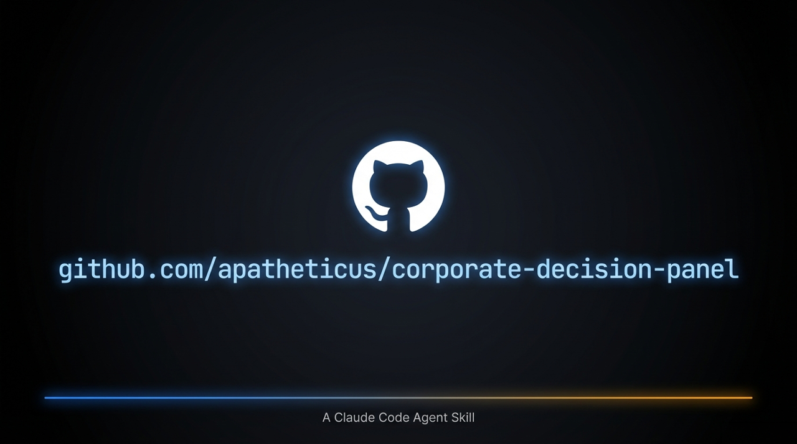

<br>

**[Back to Top](#corporate-decision-panel)**

Made with 💨 by the Zerø Effort

Copyright 2026

</div>
